# Configure Marketo Sales Insight in Salesforce Professional Edition {#configure-marketo-sales-insight-in-salesforce-professional-edition}

Here are the steps you need to take to configure Marketo Sales Insight in Salesforce Professional Edition. Let's get started.

>[!PREREQUISITES]
>
>* Install Marketo in your Salesforce Professional Edition.
>
>* [Install Marketo Sales Insight Package in Salesforce AppExchange](/help/marketo/product-docs/marketo-sales-insight/msi-for-salesforce/installation/install-marketo-sales-insight-package-in-salesforce-appexchange.md)

>[!NOTE]
>
>**Admin Permissions Required**

## Configure Sales Insight in Marketo {#configure-sales-insight-in-marketo}

1. Open a new browser window to get the Marketo Sales Insight credentials from your Marketo account.
1. Go to the Admin area and select **Sales Insight**.

   

1. Click **Edit API Configuration**.

   

1. Enter an API Secret Key of your choosing and click **Save**. Do NOT use an ampersand (&) in your API Secret Key.

   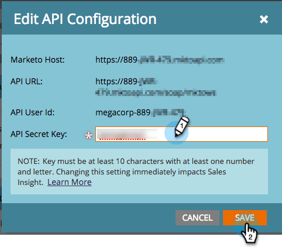

   >[!NOTE]
   >
   >Your API Secret Key is like a password for your organization and should be secure.

1. Click **View** in the Rest API Configuration panel to populate the credentials.

   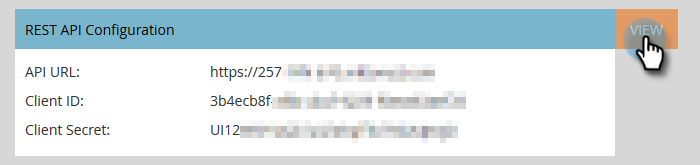

1. You will see a confirmation pop-up. Click **OK**.

   

## Configure Sales Insight in Salesforce {#configure-sales-insight-in-salesforce}

1. In Salesforce, click **Setup**.

   

1. Search for “remote site" and select **Remote Site Settings**.

   

1. Click **New Remote Site**.

   

1. Enter the Remote Site Name (it can be something like “MarketoSoapAPI”). Enter Remote Site URL, which is your Marketo Host URL from the Soap API Configuration panel in Marketo. Click **Save**. You have now created remote site settings for Soap API.

   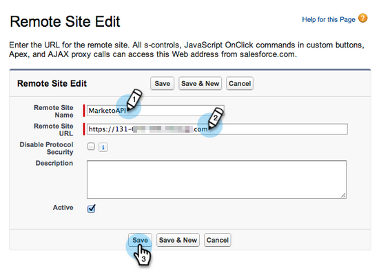

1. Click **New Remote Site** again.

   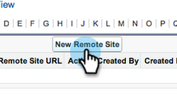

1. Enter the Remote Site Name (it can be something like “MarketoRestAPI”). Enter Remote Site URL, which is your API URL from Rest API Configuration panel in Marketo. Click **Save**. You have now created remote site settings for Rest API.

## Set up Marketo Sales Insight {#set-up-marketo-sales-insight}

1. Log in to your Marketo instance and click **Admin**.

   

1. Click **Sales Insight**.

   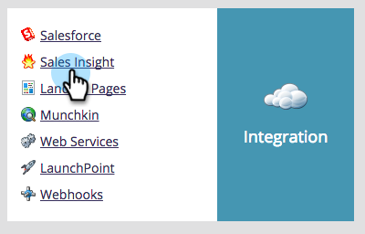

1. Click **Edit API Configuration**.

   

1. Enter an **API Secret Key** and click **Save**.

   >[!CAUTION]
   >
   >Don't use an ampersand (&) in your API Secret Key.

   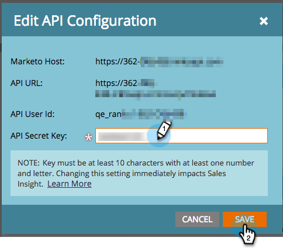

   >[!TIP]
   >
   >Keep this window open. You will need this information later in Salesforce.

1. Go back to Salesforce, click **Setup**.

   

1. Search for "remote site" and click **Remote Site Setting** under **Security Controls**.

   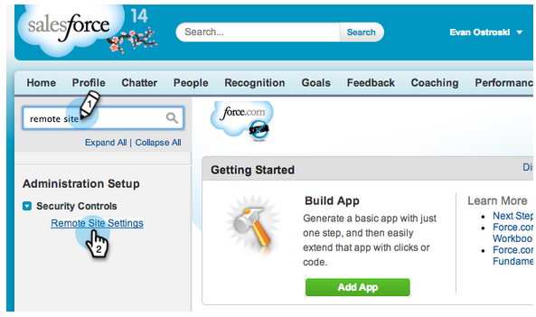

1. Click **New Remote Site**.

   

1. Enter **Remote Site Name** and **Remote Site URL**, then click **Save**.

   

   >[!NOTE]
   >
   >You choose your **Remote Site Name** (MarketoAPI is used here). The **Remote Site URL** can be found in the Marketo Host field of your Edit API Configuration dialog box from Step 4.

## Customize Page Layouts {#customize-page-layouts}

1. Click **Setup**.

   

1. Search for "page layout" and select the **Page Layout** under **Leads**.

   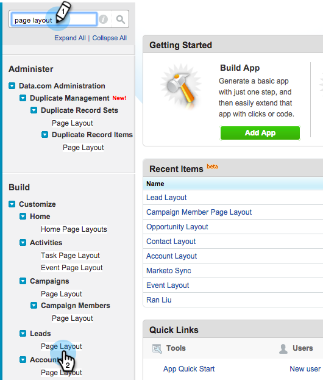

1. Click **Visualforce Pages** on the left. Drag **Section** to the layout underneath Custom Links section.

   

1. Enter "Marketo Sales Insight" as the **Section Name**. Select **1-Column** and click **OK**.

   

1. Drag and drop **Lead** into the new section.

   

   >[!TIP]
   >
   >The name of this box will change based on the object type. For example, if you are modifying the page layout for Contacts, it will say Contact.

1. Double-click on the **Lead** block that you just added.

   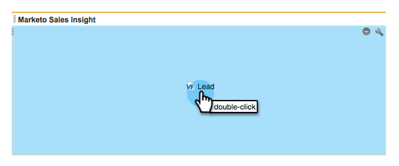

1. Edit height to **450** pixels and click **OK**.

   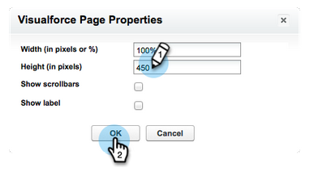

   >[!TIP]
   >
   >We recommend a height of 410 pixels for the Accounts and Opportunities objects.

1. Click on **Fields** on the left. Then search and drag the **Engagement** label into the **Marketo Sales Insight** layout.

   

1. Repeat the above step for these fields as well.

<table> 
 <tbody> 
  <tr> 
   <td colspan="1">Engagement</td> 
  </tr> 
  <tr> 
   <td colspan="1" rowspan="1">
Relative Score Value
</td> 
  </tr> 
  <tr> 
   <td colspan="1" rowspan="1">
Urgency Value
</td> 
  </tr> 
  <tr> 
   <td colspan="1" rowspan="1">
Last Interesting Moment Date
</td> 
  </tr> 
  <tr> 
   <td colspan="1" rowspan="1">
Last Interesting Moment Desc
</td> 
  </tr> 
  <tr> 
   <td colspan="1" rowspan="1">
Last Interesting Moment Source
</td> 
  </tr> 
  <tr> 
   <td colspan="1" rowspan="1">
Last Interesting Moment Type
</td> 
  </tr> 
 </tbody> 
</table>

1. lick **Save** when finished.

   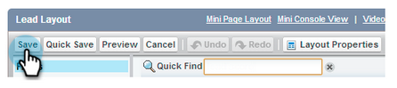

1. Repeat this process to add Visualforce page sections and Sales Insight fields for **Contact**, **Account** and **Opportunity**.
1. Repeat steps 5-7 to add Visualforce page sections for Contact, Account, and Opportunity. Then, repeat steps 8-10 to add Sales Insight fields for **Contact**. Be sure to save after any changes.

## Map Custom Person Fields {#map-custom-person-fields}

Marketo person fields need to be mapped to Salesforce contact fields to ensure that the conversion works properly. Here's how.

1. Click **Setup**.

   

1. Search for "fields" in the search bar and click **Fields** under **Leads**.

   

1. Click **Map Lead Fields**.

   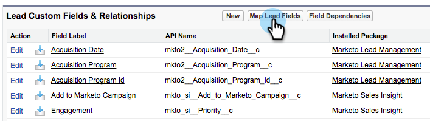

1. Click on the dropdown on the right for **Engagement**.

   

1. Select **Contact.Engagement** in the list.

   

1. Repeat and map these fields as well.

<table> 
 <tbody> 
  <tr> 
   <th colspan="1" rowspan="1">Marketo Person Custom Field</th> 
   <th colspan="1" rowspan="1">Salesforce Contact Custom Field</th> 
  </tr> 
  <tr> 
   <td colspan="1" rowspan="1">
Engagement
</td> 
   <td colspan="1" rowspan="1">
Contact.Engagement
</td> 
  </tr> 
  <tr> 
   <td colspan="1" rowspan="1">
Relative Score Value
</td> 
   <td colspan="1" rowspan="1">
Contact.Relative Score Value
</td> 
  </tr> 
  <tr> 
   <td colspan="1" rowspan="1">
Urgency Value
</td> 
   <td colspan="1" rowspan="1">
Contact.Urgency Value
</td> 
  </tr> 
  <tr> 
   <td colspan="1" rowspan="1">
Last Interesting Moment Date
</td> 
   <td colspan="1" rowspan="1">
Contact.Last Interesting Moment Date
</td> 
  </tr> 
  <tr> 
   <td colspan="1" rowspan="1">
Last Interesting Moment Desc
</td> 
   <td colspan="1" rowspan="1">
Contact.Last Interesting Moment Desc
</td> 
  </tr> 
  <tr> 
   <td colspan="1" rowspan="1">
Last Interesting Moment Source
</td> 
   <td colspan="1" rowspan="1">
Contact.Last Interesting Moment Source
</td> 
  </tr> 
  <tr> 
   <td colspan="1" rowspan="1">
Last Interesting Moment Type
</td> 
   <td colspan="1" rowspan="1">
Contact.Last Interesting Moment Type
</td> 
  </tr> 
 </tbody> 
</table>

1. Click **Save** when you’re done.

   

## Marketo Sales Insight Config {#marketo-sales-insight-config}

1. Click **+** and then select **Marketo Sales Insight Config**.

   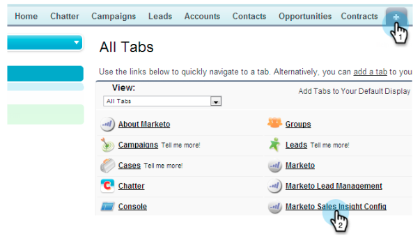

1. Check **Enable Marketo API**. Then fill in the [API Configuration info in Marketo Admin](#set-up-marketo-sales-insight). Click **Save Changes** when you are done.

   

   >[!NOTE]
   >
   >If the diagnostics test failed, you might need to [add more fields to your page layout](https://nation.marketo.com/docs/DOC-1115).

And that's it! You should be able to see the Marketo Sales Insight fields for Leads, Contacts, Accounts and Opportunities.

>[!NOTE]
>
>For accounts, Sales Insight will include all emails, but only the most recent interesting moments, web activity, and score changes.

## Access Marketo Sales Insight {#access-marketo-sales-insight}

1. In Salesforce, click the **+** at the end of the tab bar and click **Marketo Sales Insight Config**.

1. Select the **Enable Marketo API** checkbox.

1. Copy the credentials from the Soap API panel in Marketo’s Sales Insight Admin page and paste them into the Soap API section of the Salesforce Sales Insight Configuration page.

1. Copy the credentials from the Rest API panel in Marketo’s Sales Insight Admin page and paste them into the Rest API section of the Salesforce Sales Insight Configuration page.

   

>[!MORELIKETHIS]
>
>* [Priority, Urgency, Relative Score, and Best Bets](/help/marketo/product-docs/marketo-sales-insight/msi-for-salesforce/features/stars-and-flames/priority-urgency-relative-score-and-best-bets.md)
>* [Add Marketo Sales Insight Tab and Buttons to Salesforce](/help/marketo/product-docs/marketo-sales-insight/msi-for-salesforce/features/bulk-actions/add-marketo-sales-insight-tab-and-buttons-to-salesforce.md)
