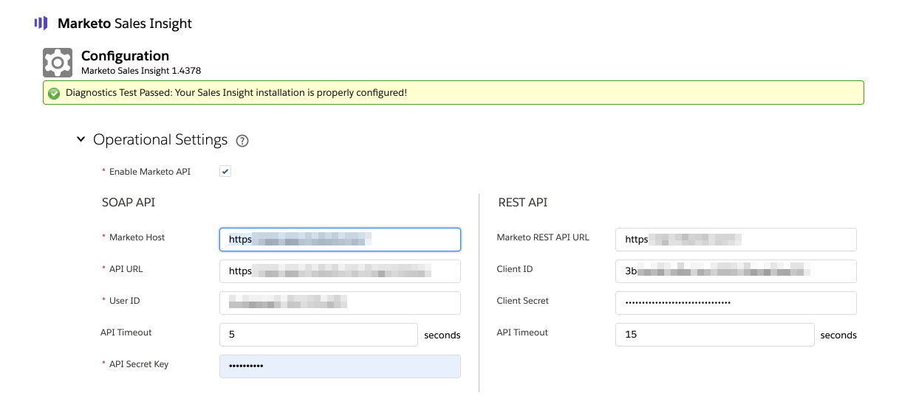
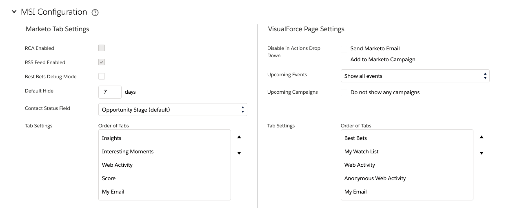

# Marketo Sales Insight Configuration Tab in Salesforce {#marketo-sales-insight-configuration-tab-in-salesforce}

## Operational Settings {#operational-settings}

You will need to have this set up in order to start using Sales Insight in SFDC.

* MSI uses both Soap and Rest API
* The Sales Insight page in your Marketo account will have two corresponding panels with Soap and Rest API credentials that you can copy and paste here
* Soap and Rest API have separate time outs which you can set based on your organization's needs. The maximum time allowed is 120 seconds
* Disabling Insights Dashboard: You can remove Rest API credentials and only use Soap API. Doing so will disable the Insights Dashboard tab in all of your MSI visualforce panels

## MSI Configuration {#msi-configuration}

Configurations are applicable to all MSI users and are not specific to profiles.

**Marketo Tab Settings**

* Best Bets Debug Mode
* Default Hide - The option you choose here will be the number of days a best bet will be hidden in the Best Bets tab in Marketo when you click on “Hide” icon
* Contact Status Field - The option you choose here will be the value that's populated in the Status Header column in the Best Bets tab in Marketo
* Tab Settings - All 5 tabs will be available by default. You can choose the order of tabs in Marketo global page

**Visualforce Page Settings**

* Enable Action drop-down:

    * Ability to hide Send Marketo email from drop down in Lead & Contact MSI Layout
    * Ability to hide Add to Marketo Campaign options from drop down in Lead & Contact MSI Layout

* Upcoming events: Ability to show invited events, all events to users or completely hide this tab
* Upcoming campaigns: Ability to show all email campaigns or completely hide this tab
* Tab Settings - All 5 tabs will be available by default. All 5 tabs will be available by default. You can choose the order of tabs in Sales Insight panel. The same order will be applicable to all layout (Lead, Contact, Account, Opportunity)

**Limits**

* Activity (Interesting Moment, Web Activity, Email) is set to 1000 by default. Email campaigns and Events are set to be 200 by default
* In case you notice time out issues on your org, you can reduce the limit

## Reset Marketo Sales Insight {#reset-marketo-sales-insight}

Choosing to do so will wipe all your configurations in SFDC and they cannot be restored. You will have to re-configure everything again.

