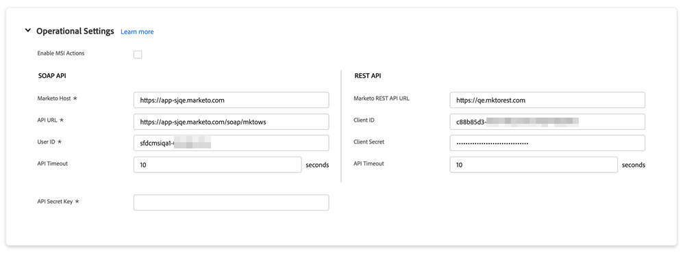
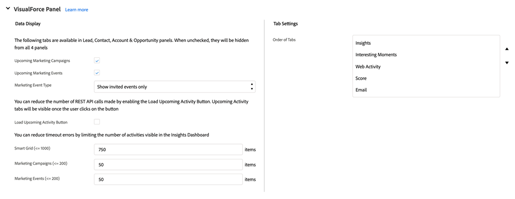
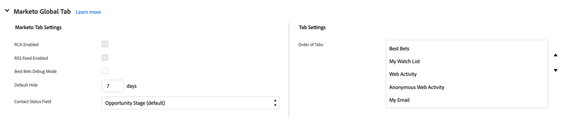
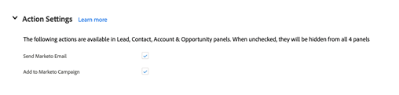
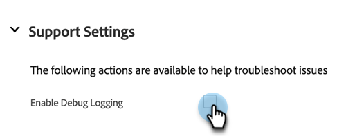

# Marketo Sales Insight Configuration Tab in Salesforce {#marketo-sales-insight-configuration-tab-in-salesforce}

## Operational Settings {#operational-settings}

You will need to have this set up in order to start using Sales Insight in SFDC.

* MSI uses both Soap and Rest API
* The Sales Insight page in your Marketo account will have two corresponding panels with Soap and Rest API credentials that you can copy and paste here
* Soap and Rest API have separate time outs which you can set based on your organization's needs. The maximum time allowed is 120 seconds
* Disabling Insights Dashboard: You can remove Rest API credentials and only use Soap API. Doing so will disable the Insights Dashboard tab in all of your MSI visualforce panels

## MSI Configuration {#msi-configuration}

Configurations are applicable to all MSI users and are not specific to profiles.

**Visualforce Page Settings**

* Enable Action drop-down:
  * Ability to hide Send Marketo email from drop-down in Lead and Contact MSI Layout
  * Ability to hide Add to Marketo Campaign options from drop-down in Lead and Contact MSI Layout
* Upcoming events: Ability to show invited events, all events to users, or completely hide this tab
* Upcoming campaigns: Ability to show all email campaigns or completely hide this tab
* Load Upcoming Campaigns and Events: Ability to reduce number of Rest API calls made by users by placing events and campaigns tab behind an on-demand “Load Upcoming Items” button
* Tab Settings: All five tabs will be available by default. You can choose the order of tabs in the Sales Insight panel. The same order will be applicable to all layouts (Lead, Contact, Account, Opportunity)

**Marketo Global Tab**

* RSS Feed Enabled: When enabled, MSI users can view their Lead Feed in an RSS feed (in addition to the Lead Feed in Salesforce). The RSS feed can only function if the “Token Expiration” feature is disabled. This setting is controlled in your Marketo Sales Insight Admin page.
* Best Bets Debug Mode
* Default Hide: The option you choose here will be the number of days a best bet will be hidden in the Best Bets tab in Marketo when you click the “Hide” icon
* Contact Status Field: The option you choose here will be the value that’s populated in the Status Header column in the Best Bets tab in Marketo
* Live Feed Settings: The option to choose to show only Live Feed (in Lead, Contact, Account, and Opportunity panels, and the Global Marketo page), only Lead Feed (in the Marketo Global Page) or both Live and Lead Feed
* Tab Settings: All five tabs will be available by default. You can choose the order of tabs in the Marketo global page

**Limits**

* Activity (Interesting Moment, Web Activity, Email) is set to 1000 by default. Email campaigns and Events are set to be 200 by default
* In case you notice time out issues on your org, you can reduce the limit

**Action Settings**

* Send Marketo Email: Enabling this will give all Sales Insight users access to send emails from the Lead, Contact, Account, Opportunity panels and the Best Bets tab (bulk actions and inline engagement)
* Add to Marketo Campaign: Enabling this will give all Sales Insight users access to add to campaigns from the Lead, Contact, Account, Opportunity panels and the Best Bets tab (bulk actions and inline engagement)

## Reset Marketo Sales Insight {#reset-marketo-sales-insight}

Choosing to do so will wipe all your configurations in SFDC and they cannot be restored. You will have to re-configure everything again.

>[!IMPORTANT]
>
>Do not select the "Enable MSI Actions" checkbox unless you’re using Sales Insights Actions features.

>[!MORELIKETHIS]
>
>[Add Sales Insight Access to Profiles](/help/marketo/product-docs/marketo-sales-insight/msi-for-salesforce/configuration/add-sales-insight-access-to-profiles.md){target="_blank"}
