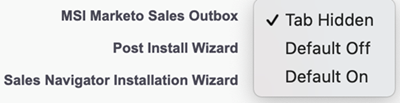
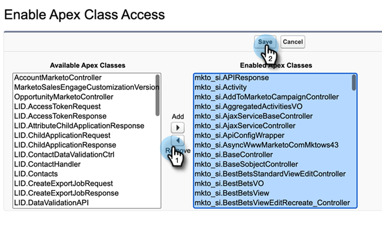
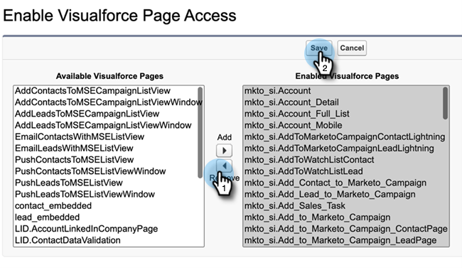
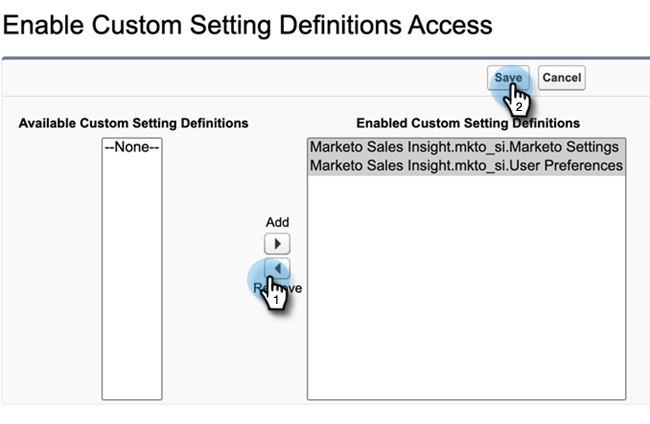

# Remove Sales Insight Access {#remove-sales-insight-access}

Use the following steps to remove access to Sales Insight features in Salesforce. Applicable to Salesforce Classic and Lightning.

## Overview {#overview}

Permission to the objects mentioned below, apex classes, and visualforce pages is required to access all Sales Insight features. Removing these will remove access to Sales Insight.

**Object Settings**

<table> 
 <tbody> 
 <tr> 
   <td>BestBetsCache</td> 
   <td>Read, Create, Edit, Delete, View All, Modify All</td> 
  </tr> 
  <tr> 
   <td>Best Bets View Details</td> 
   <td>Read, Create, Edit, Delete, View All, Modify All</td> 
  </tr> 
  <tr> 
   <td>Best Bets Views</td> 
   <td>Read, Create, Edit, Delete, View All, Modify All</td> 
  </tr> 
  <tr> 
   <td>EmailActivityCache</td> 
   <td>Read, Create, Edit, Delete, View All, Modify All</td> 
  </tr> 
  <tr> 
   <td>GetMethodArgus</td> 
   <td>Read, Create, Edit, Delete, View All, Modify All</td> 
  </tr> 
  <tr> 
   <td>GroupedWebActivityCache</td> 
   <td>Read, Create, Edit, Delete, View All, Modify All</td> 
  </tr> 
  <tr> 
   <td>InterestingMomentsCache</td> 
   <td>Read, Create, Edit, Delete, View All, Modify All</td> 
  </tr> 
  <tr> 
   <td>Marketo Sales Insight Config</td> 
   <td>Read, Create, Edit, Delete, View All, Modify All</td> 
  </tr> 
  <tr> 
   <td>ScoringCache</td> 
   <td>Read, Create, Edit, Delete, View All, Modify All</td> 
  </tr> 
  <tr> 
   <td>Values</td> 
   <td>Read, Create, Edit, Delete, View All, Modify All</td> 
  </tr> 
  <tr> 
   <td>WebActivityCache</td> 
   <td>Read, Create, Edit, Delete, View All, Modify All</td> 
  </tr> 
 </tbody> 
</table>

* Apex Class Access: 159 Apex Classes that being with “mkto_si”
* Visualforce Page Access: 64 Visualforce Pages that being with “mkto_si”
* Custom Setting Definitions: mkto_si.Marketo Settings & mkto_si.User Preferences

## Removing Access to Sales Insight {#removing-access-to-sales-insight}

1. Log in to your Salesforce account.

1. Click **Setup**.

   

1. Under Administrator, click **Manage Users**, then **Profiles**.

1. Click on the profile you'd like to update, then **Edit**.

1. Scroll down to “Custom Tab Settings” under Tab Settings.

1. Select the “Tab Hidden” option from the drop-down for Marketo Sales Insight Config and MSI Marketo Sales Outbox.

   

   

1. Scroll down to “Custom Object Permissions.”

1. Remove "Read, Create, Edit, Delete" access from following objects:

   * BestBetsCache
   * Best Bets View Details
   * Best Bets Views
   * EmailActivityCache
   * GetMethodArgus
   * GroupedWebActivityCache
   * InterestingMomentsCache
   * Marketo Sales Insight Config
   * ScoringCache
   * Values
   * WebActivityCache

1. Scroll down to the “Enabled Apex Class Access” section. Click **Edit**.

1. From the “Enabled Apex Classes” section, select all classes that begin with “mkto_si”. This should add up to 159 classes.  

1. Click **Remove**, then **Save**.

   

1. Scroll down to “Enabled Visualforce Page Access” section. Click **Edit**.

1. From the “Enabled Visualforce Pages” section, select all pages that begin with “mkto_si”. This should add up to 64 pages.  

1. Click **Remove**, then **Save**.

   

1. Scroll down to the “Enabled Custom Setting Definitions Access” section. Click **Edit**.

1. Select "Marketo Sales Insight.mkto_si.Marketo Settings" and "Marketo Sales Insight.mkto_si.User Preferences."  

1. Click **Remove**, then **Save**.

   

That’s it! You’ve successfully removed Sales Insight access. Repeat the same steps for any other profile you’d like to remove access for.
