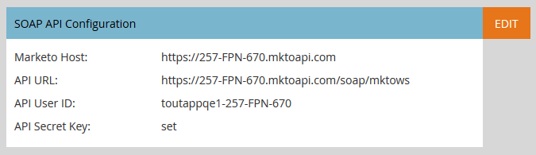
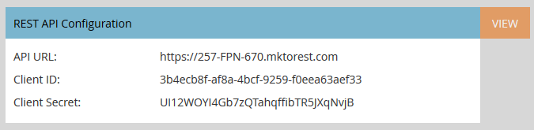
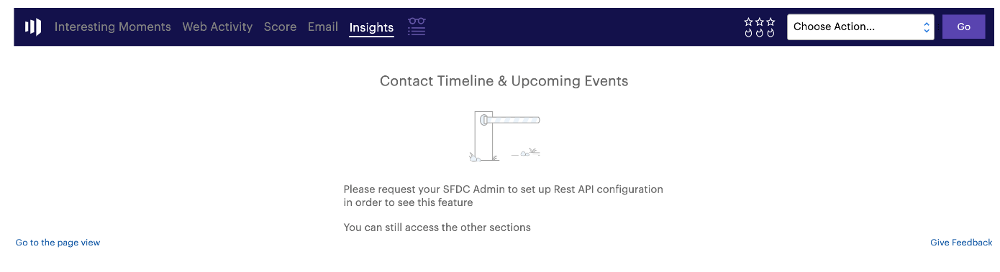
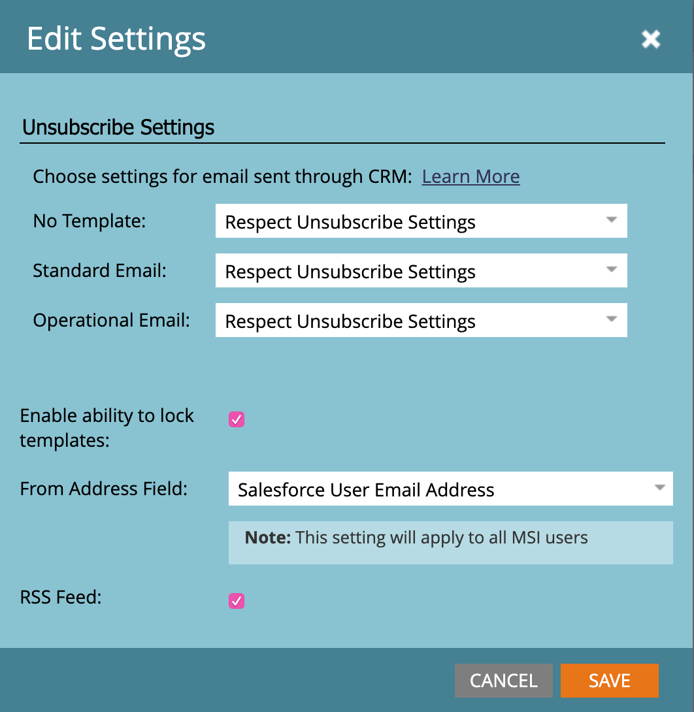

# Sales Insight Page for Marketo Admins {#sales-insight-page-for-marketo-admins}

Marketo Admins have certain privileges in Sales Insight. Learn what they are below.

### What's in this article? {#whats-in-this-article}

[Soap API Configuration](#soap-api-configuration)  
[Rest API Configuration](#rest-api-configuration)  
[Person Score Settings](#person-score-settings)  
[Settings](#settings)

#### Soap API Configuration {#soap-api-configuration}

These credentials are used to connect your Salesforce account to your Marketo instance, in order to use MSI in Salesforce.

#### Rest API Configuration {#rest-api-configuration}

These credentials are used to connect your Salesforce account to your Marketo instance, in order to use MSI Insights Dashboard in Salesforce.

You can choose to remove Rest API credentials in SFDC and use only Soap APIs. This will disable the Insights Dashboard

#### Person Score Settings {#person-score-settings}

| **Stars:** |Stars represent total lead score compared to other leads. |
|---|---|
| **Flames:** |Flames represent urgency - how much a lead's score has changed recently. |

By default, Marketo Sales Insight uses the Lead Score field to calculate stars and flames. But if you want to pick a different field, here's how:

1. In the **Admin** area of Marketo, click **Sales Insight**.

   

1. Under Lead Scoring Settings, click **Edit**.

   

1. Select the field you want to use for stars.

   

1. Select the field you want to use for flames.

   

1. Click **Save**. Sales insight will take some time to re-calculate. You can check your CRM later to see the stars and flames.

   

   >[!TIP]
   >
   >If you don't already have your custom score fields, here's how to [create them](http://docs.marketo.com/x/3wMk).

   >[!NOTE]
   >
   >**Related Articles**
   >
   >
   >[Stars and Flames](http://docs.marketo.com/x/qgU6Ag)

#### Settings {#settings}

**Unsubscribe Settings: **

You can choose the from following unsubscribe settings for No Template, Standard Emails & Operational emails

* Respect Unsubscribe Setting
* Respect Unsubscribe Settings when more than 1 recipient
* Respect Unsubscribe Settings when more than 5 recipients
* Ignore Unsubscribe Settings

**Enable ability to lock templates: **

When enabled, MSI users will not be able to edit templates while sending emails from Salesforce

**Enable RSS Feed:**

When enabled, MSI users can view their Lead Feed in an RSS feed (in addition to the Lead Feed in Salesforce)**.**
