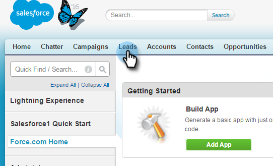
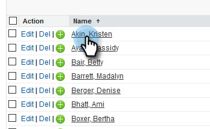
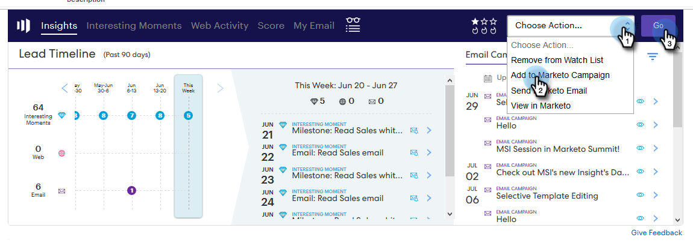
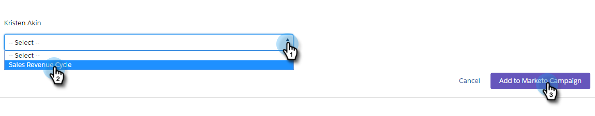

# Add a Lead/Contact to a Marketo Campaign from Salesforce {#add-a-lead-contact-to-a-marketo-campaign-from-salesforce}

You can easily add leads or contacts to Marketo smart campaigns from within Salesforce. Here's how, using leads.

1. In Salesforce, click the **Leads** tab.

   

1. Select the list of people you want to view from the drop-down and click **Go**.

   

   >[!NOTE]
   >
   >The pick list in the drop-down includes All Open Leads or Unread Leads, Recently Viewed Leads, Today's Leads, and may include other categories.

1. Select a lead from the list to open the record.

   

1. In the record, scroll down to the Marketo Sales Insight area, click the **Actions** drop-down, select **Add to Marketo Campaign**, and click **Go**.

   

1. Click the **Campaign Name** drop-down, select the desired Marketo campaign, and click **Add to Marketo Campaign**.

   

   >[!NOTE]
   >
   >For the campaign to appear in the drop-down, use the [**Campaign is Requested** trigger](/help/marketo/product-docs/core-marketo-concepts/smart-campaigns/using-smart-campaigns/setting-up-a-trigger-smart-campaign-for-sales-using-campaign-is-requested.md), with **Sales Insight** as the source, when you set up the campaign.

And that's it! The person is added to your Marketo campaign.
