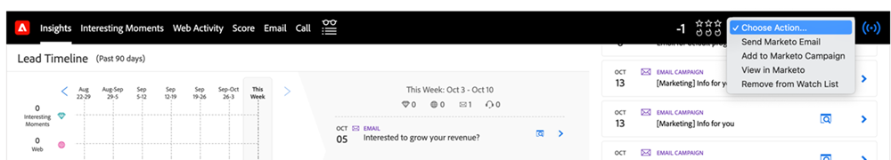
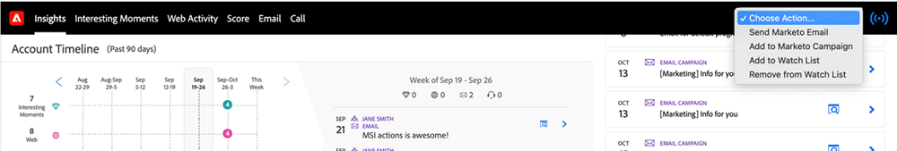
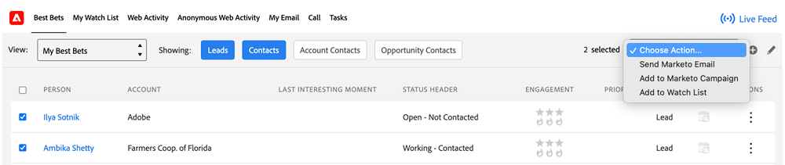
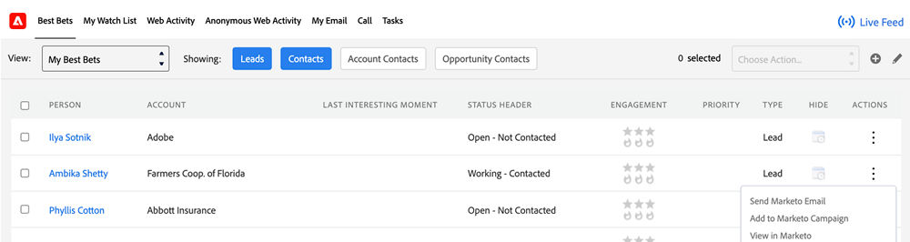
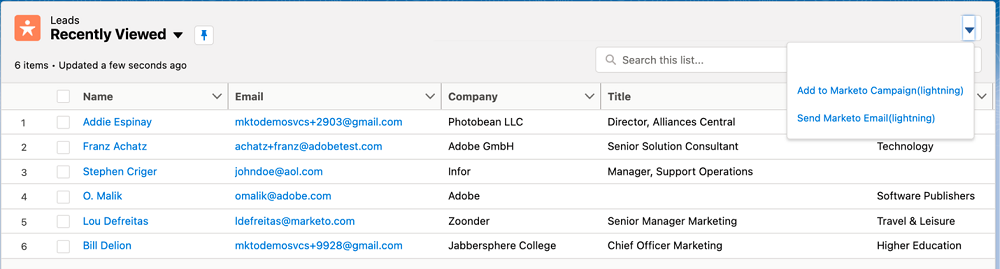

# Choose an Action in Sales Insight {#choose-an-action-in-sales-insight}

The following actions are available from the Sales Insight drop-down in Salesforce Classic and Lightning:

* Send Marketo Email
* Add to Marketo Campaign
* Add to Watch List

Each of these features can be accessed from:

**Page Layout with single action**

* Lead Layout Panel: Single action and can be controlled by user profile
* Contact Layout Panel: Single action and can be controlled by user profile
* Lead Layout Button: Single action and cannot be controlled by user profile
* Contact Layout Button: Single action and cannot be controlled by user profile

   

**Page Layout with group action**

* Account Layout Panel: Group action and can be controlled by user profile
* Opportunity Layout Panel: Group action and can be controlled by user profile

   

**Best Bets tab**

* Best Bets Bulk Actions Tab: Group action and can be controlled by user profile

   

* Best Bets In-line Actions Tab: Single action and can be controlled by user profile

   

**List View with bulk action**

* Lead List View: Bulk action and cannot be controlled by user profile
* Contact List View: Bulk action and cannot be controlled by user profile

   
