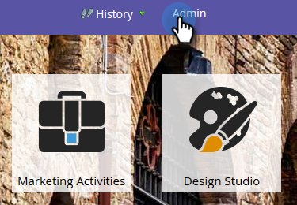

# Configure Unsubscribe Footers in Marketo Sales Insight {#configure-unsubscribe-footers-in-marketo-sales-insight}

Sales emails automatically put the unsubscribe footer at the bottom. However, you can adjust the settings to meet your needs.

>[!NOTE]
>
>**Admin Permissions Required**

>[!NOTE]
>
>**Definition**
>
>**Sales emails** are those sent from Sales Insight. (It does not include those sent from the Marketo Outlook Plugin.)

1. Go to the **Admin** area.

   

1. Click **Sales Insight, **then **Edit Settings**.

   

   There are several options. First let's take a look at the types of emails you can change the settings for.

   

    * **No Template **- Manually composed by sales user.
    * **Standard Email** - Emails based on a template.
    * **Operational Email** - Emails that ignore Unsubscribed, Marketing Suspended, and Communication Limits (they send no matter what).

   You have the option to set different behavior for each type.

   >[!CAUTION]
   >
   >**Respect Unsubscribe Settings: **unsubscribed leads will NOT receive the email even if the published email is "operational"
   >
   >
   >**Ignore Unsubscribe Settings:** unsubscribed leads WILL receive the email

   Make the changes you want, then click Save.

   >[!TIP]
   >
   >The last two choices allow you to dynamically include/exclude the unsubscribe footer depending on number of recipients (Greater than 1 or Greater than 5).

   

Whew! A little complicated, but pretty flexible, right?

>[!NOTE]
>
>**Deep Dive**
>
>Learn more about  [Marketo Sales Insight](http://docs.marketo.com/display/docs/marketo+sales+insight).

