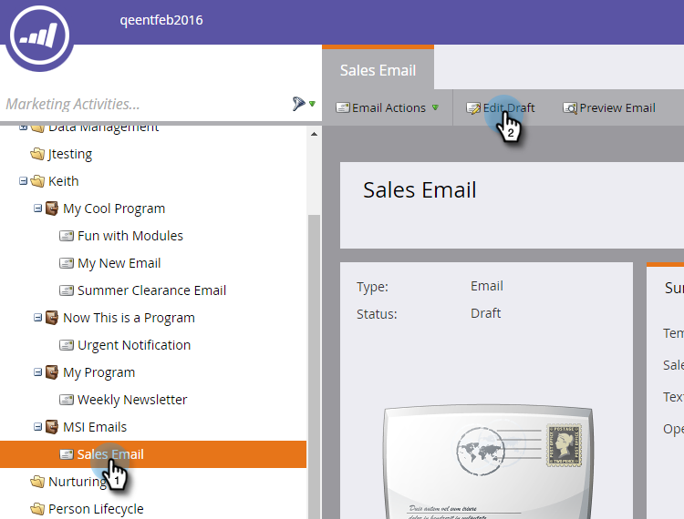
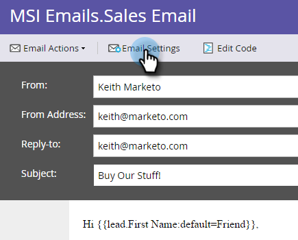

# Publish an Email to Sales Insight {#publish-an-email-to-sales-insight}

Enable the Publish to Sales Insight setting to make an email available to your sales team in both Sales Insight as well as the Outlook and Gmail Add-In. You can also give it an expiration date.

1. Find your email, select it and click **Edit Draft**.

   

1. Once the editor opens, click **Email Settings**.

   

1. Check **Publish to Marketo Sales Insight**.

   

1. To set an expiration date (optional), check **Set Expiration** and choose a date.

   

   >[!NOTE]
   >
   >At 11:59 p.m. (CST) on the expiration date (if you set one), the email you made available will disappear from Sales Insight as well as any of its add-ins. It will of course still be accessible in Marketo.

1. Click **Save**.

   

Nice job! Now you know how to make emails available for your sales team to send on the CRM side, and to limit their available time, if necessary.

>[!NOTE]
>
>[My Tokens](/help/marketo/product-docs/core-marketo-concepts/programs/tokens/understanding-my-tokens-in-a-program.md) will not resolve when sending an email from Sales Insight on either Microsoft Dynamics or Salesforce; only standard tokens will populate (Lead, Company, etc.). Default values for tokens will work, however.

>[!TIP]
>
>Don't forget to approve this email in order for the changes to take effect. Learn how to [Approve an Email](/help/marketo/product-docs/email-marketing/general/creating-an-email/approve-an-email.md).
