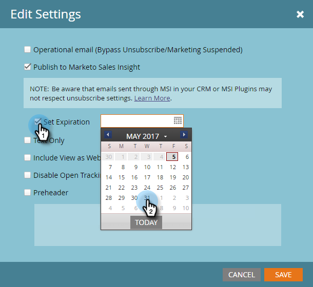

# Publish an Email to [!DNL Sales Insight] {#publish-an-email-to-sales-insight}

Enable the Publish to [!DNL Sales Insight] setting to make an email available to your sales team in both [!DNL Sales Insight] as well as the [!DNL Outlook] and Gmail Add-In. You can also give it an expiration date.

1. Find your email, select it and click **[!UICONTROL Edit Draft]**.

   

1. Once the editor opens, click **[!UICONTROL Email Settings]**.

   

1. Check **[!UICONTROL Publish to Marketo Sales Insight]**.

   

1. To set an expiration date (optional), check **[!UICONTROL Set Expiration]** and choose a date.

   

   >[!NOTE]
   >
   >At 11:59 p.m. (CST) on the expiration date (if you set one), the email you made available will disappear from [!DNL Sales Insight] as well as any of its add-ins. It will of course still be accessible in Marketo.

1. Click **[!DNL Save]**.

   

Nice job! Now you know how to make emails available for your sales team to send on the CRM side, and to limit their available time, if necessary.

>[!NOTE]
>
>[My Tokens](/help/marketo/product-docs/core-marketo-concepts/programs/tokens/understanding-my-tokens-in-a-program.md) will not resolve when sending an email from [!DNL Sales Insight] on either [!DNL Microsoft Dynamics] or [!DNL Salesforce]; only standard tokens will populate (Lead, Company, etc.). Default values for tokens will work, however.

>[!TIP]
>
>Don't forget to approve this email in order for the changes to take effect. Learn how to [Approve an Email](/help/marketo/product-docs/email-marketing/general/creating-an-email/approve-an-email.md).
