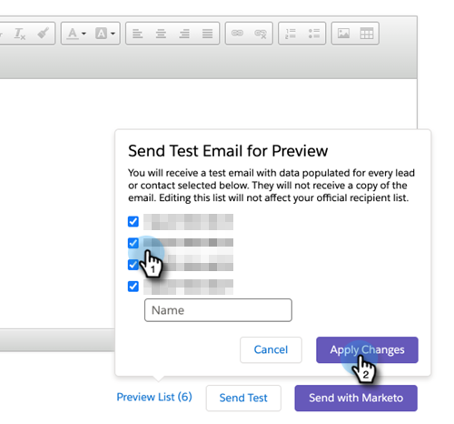

# Send a Test Email {#send-a-test-email}

Before sending an email, you can test the email format and tokens by sending a test email to yourself at any email address.

1. Navigate to the Sales Insight panel in Salesforce of a lead or contact.

1. Click **Send Marketo Email**.

1. Click **Edit Test Recipients**.

1. You can choose one or more leads from the list to see how it will render to them. Click **Apply Changes** when done.

   

   >[!NOTE]
   >
   >As a reminder, selecting those leads **does not** send them the email test, it shows you _how the email will look to them_. If you choose four leads, you will receive four different test emails.

1. Click **Send Test**.

You'll receive an email with token values populated for the leads you chose.

   >[!NOTE]
   >
   >Don’t worry, you'll remain on the "Send Marketo Email" page even after sending the test email, so you won’t lose the email you’ve created.
