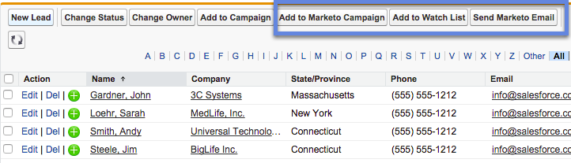
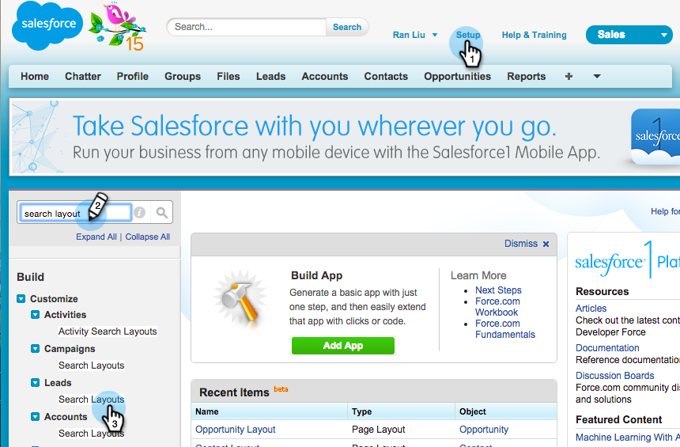
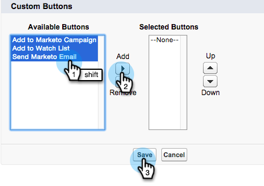

# Add Marketo Sales Insight Tab and Buttons to Salesforce {#add-marketo-sales-insight-tab-and-buttons-to-salesforce}

You can add custom Marketo Sales Insight tab and buttons to your Salesforce view for easy access. Interested? Here's how.

## Adding the Marketo Tab  {#adding-the-marketo-tab}

1. Click** + **and click **Customize My Tabs**.

   

1. Select Marketo in the left list. Then click **Add** to add it to the **Selected Tabs**.

   >[!TIP]
   >
   >Use the **Up** and **Down** arrow to reorder your tabs.

   

   And here is your Marketo tab!

   

## Adding Marketo Buttons {#adding-marketo-buttons}

You can add Marketo buttons to your Salesforce Layouts. Here's an example:

1. Click **Setup**. Search for "search layout" and click the **Search Layouts** under **Leads**.

   

1. Click **Edit** in the **Leads List View **row.

   

1. Add **Add to Marketo Campaign**, **Send Marketo Email**, and **Add to Watch List** buttons to the **Selected Buttons** and **Save**.

   

   >[!TIP]
   >
   >Press and hold the Shift key to select all three buttons at once.

1. Repeat these steps for your Contacts (all three buttons) and Accounts (only one button: Add to Watch List).

   >[!NOTE]
   >
   >You cannot add Marketo buttons to Opportunities.

Great job!
