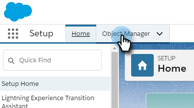
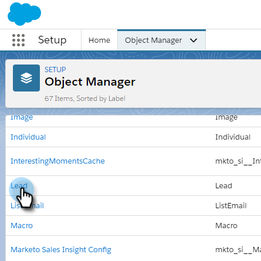
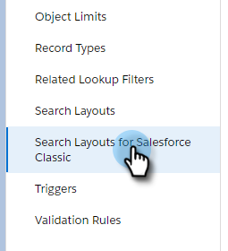

# Bulk Actions in Salesforce Lightning {#bulk-actions-in-salesforce-lightning}

Bulk Actions in Salesforce Lightning - Marketo Docs - Product Documentation

Here's how to set up bulk actions in Salesforce Lightning.

1. In Salesforce, click the Setup icon and select **Setup**.

   

1. Click the **Object Manager** tab.

   

1. Find and select the **Lead** label.

   

1. Click **Search Layouts for Salesforce Classic**.

   

   Find the List View layout. Click the drop-down to the right and select **Edit**.

   

1. Under Custom Buttons, find and select **Add to Marketo Campaign (lightning)** and **Send Marketo Email (lightning)**. Click the **Add** button.

   

1. Click **Save**.

   

   You will now be able to see bulk action buttons in your Lead List View.

   >[!NOTE]
   >
   >Repeat the same steps to add bulk actions in your Contact list view.

