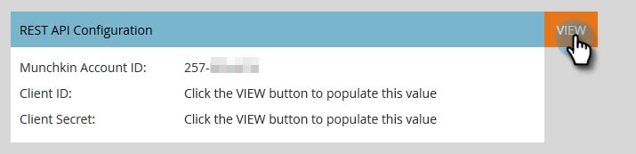

# Configuration for Existing Customers {#configuration-for-existing-customers}

Please set up the following configuration in order to begin using the new Insights Dashboard.

### What's in this article? {#whats-in-this-article}

[Configure Sales Insight in Marketo](#configure-sales-insight-in-marketo)  
[Configure Sales Insight in Salesforce](#configure-sales-insight-in-salesforce)  
[Access Marketo Sales Insight](#access-marketo-sales-insight)

>[!NOTE]
>
>**Prerequisites**
>
>Please make sure you have upgraded your Salesforce package to the latest version

#### Configure Sales Insight in Marketo {#configure-sales-insight-in-marketo}

1. Open a new tab in your browser to get the Marketo Sales Insights credentials from your Marketo account.
1. Go to the **Admin** area.

   

1. Click **Sales Insight**.

   

1. Click **View** to populate Rest API credentials.

   

1. You'll see a confirmation pop-up. Click **OK**.

#### Configure Sales Insight in Salesforce {#configure-sales-insight-in-salesforce}

1. In Salesforce, click **Setup**.

   

1. Search for and select **Remote Site Settings**.

   

1. Click **New Remote Site**.

   

1. Enter the Remote Site Name (it can be something like “MarketoRestAPI”), and the Remote Site URL (your API URL from Rest API Configuration panel in Marketo).

   

1. Click **Save**.

   

   You have now created remote site setting for Rest API.

#### Access Marketo Sales Insight {#access-marketo-sales-insight}

1. Copy the credentials from the Rest API panel in Marketo’s Sales Insight Admin page. Paste them in the Rest API section in Salesforce’s Sales Insight Configuration page.
1. Enter the API Secret Key.

   

