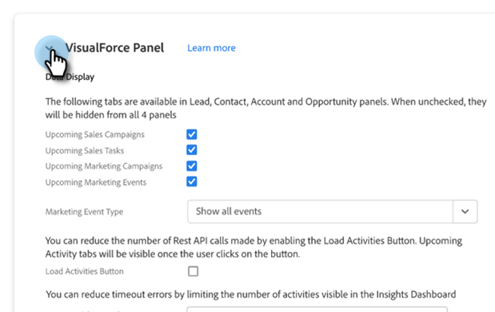
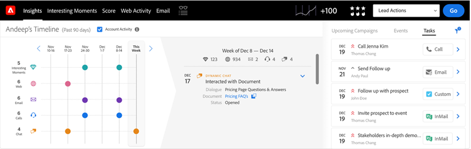
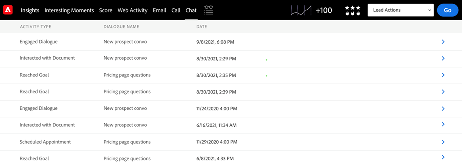
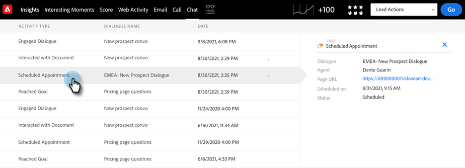
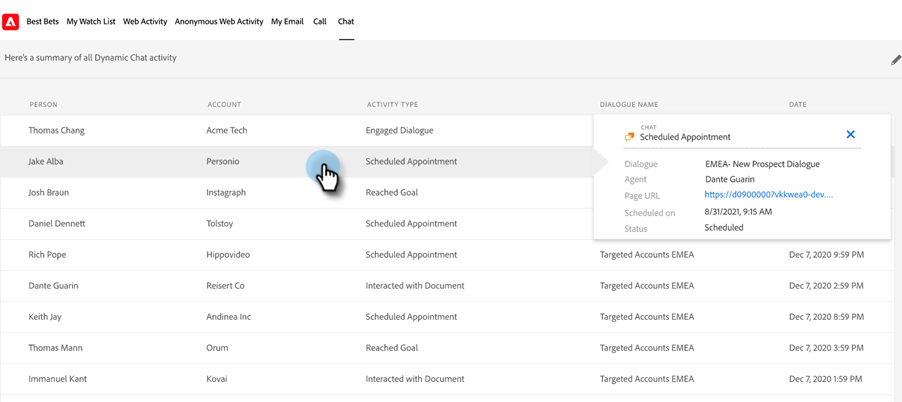

# Dynamic Chat Integration {#dynamic-chat-integration}

Learn more about the Dynamic Chat integration with Sales Insight.

>[!PREREQUISITES]
>
>* Your Sales Insight SFDC package must be version [1.9 or higher](/help/marketo/product-docs/marketo-sales-insight/msi-for-salesforce/upgrading/upgrading-your-msi-package.md){target="_blank"}
>
>* You must have the [Dynamic Chat integration](/help/marketo/product-docs/demand-generation/dynamic-chat/dynamic-chat-overview.md){target="_blank"} set up

## Marketo Sales Insight Configuration Tab {#marketo-sales-insight-configuration-tab}

Follow the steps below to to enable the Dynamic Chat integration.

1. Log in to your Salesforce account, click the + at the end of the tab bar and click **Marketo Sales Insight Config**.

1. Click to unfurl the "Visualforce Panel."

   

1. Select the **Enable Dynamic Chat Data** checkbox.

   

## Feature Overview {#feature-overview}

The following Dynamic Chat activities can be leveraged by Sales Insight users...

Engaged Dialogue: Logged in Marketo and populated in Sales Insight when a visitor clicks on a chatbot and engages with the Dialogue.

* Dialogue Name
* Page URL
* Status (Initiated / Dropped / Completed)

Scheduled Appointment: Logged in Marketo and populated in Sales Insight when a visitor successfully schedules an appointment via the chatbot.

* Dialogue Name
* Agent
* Page URL
* Scheduled on (insert date and time stamp)
* Status (Scheduled, Rescheduled, Cancelled)

Reached Goal: Logged in Marketo and populated in Sales Insight when a visitor reaches a goal in any Dialogue flow.

* Dialogue Name
* Goal Name
* Page URL

Interacted with Document: Logged in Marketo and populated in Sales Insight when a visitor interacts with a document shared via the chatbot.

* Dialogue Name
* Document
* Status

Chat activities are available in Insights Dashboard. 

   

A Chat tab is available in Lead and Contact panels. It includes Activity Type, Dialogue Name and Date columns.

   

You can learn more about an activity type by clicking on it.  

   

Similarly, Account and Opportunity panels include Name, Activity Type, Dialogue Name and Date columns.

   

The Chat tab is also included in your Global Marketo tab. It includes three activity types (Engaged Dialogue, Scheduled Appointment, Reached Goal), along with the following columns:

* Person
* Account
* Activity type (Engaged Dialogue, Scheduled Appointment, Reached Goal)
* Dialogue Name
* Date & Time Stamp

Again, you can learn more about an activity type by clicking on it.

   

>[!NOTE]
>
>If the "Enable Dynamic Chat data" checkbox is disabled, the following features will be disabled:
>
>* Row with Chat activities in the Insights Dashboard (smart grid and weekly list view)
>* Chat tab in the Lead, Contact, Account and Opportunity panels
>* Chat tab in the Global Marketo tab
>
>It is not possible to disable only one of these features. 

