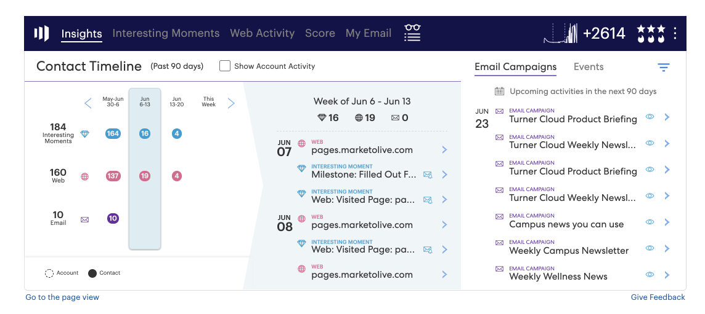

# Insights Dashboard Feature Overview {#insights-dashboard-feature-overview}

Learn more about the features available in your Sales Insights dashboard.

>[!PREREQUISITES]
>
>You must have the latest MSI SFDC package and [configuration](/help/marketo/product-docs/marketo-sales-insight/msi-for-salesforce/configuration/configuration-for-existing-customers.md).

## Contact Layout {#contact-layout}

**Engagement Velocity Grid**

* This smart grid includes Interesting Moments, Email and Web Activity in the last 90 days
* User can choose to “Show Account” activity, this will layer all account level Interesting Moments, Email and Web Activity in the contact view
* User can highlight specific week in order to see activities within that week
* Default View: Current week is selected

**Engagement Drill Down and Summary**

* Drill down activity cards for Interesting Moments, Email and Web Activity
* Interesting Moments Activity card - Includes Subscribe Option
* Email Activity card - Includes Preview Option
* Web Activity card - Includes ability to click on link
* Weekly Summary bar will show Interesting Moments, Email and Web Activity for that week. Each icon is clickable and can be used as filters to show specific activity
* Default View: This is a list of activities of current view

**Upcoming Email Campaigns and Events**

Email Campaigns tab:

* Includes campaigns that are part of email programs or default programs scheduled within the next 90 days
* Not specific to the contact/lead (i.e., list of campaigns is a generic list of all email campaigns scheduled in the Marketo instance). The list of campaigns across all lead, contact, account, and opportunity panels will be the same
* If campaign recurrence is such that it runs more than three times in the next 90 days, only the next three runs will be shown at any given point in time (similar to the behavior in Marketo)
* The activity details card in this section will have a preview option. If the flow includes multiple send email steps, all emails will be available to preview. Within the send email flow step, if there are multiple “email choices”, the default option will be available for preview
* Filters include “Search” and “Date Range”

Event tab:

* Includes Event Programs scheduled within the next 90 days
* Use the filter option to see all events/invited events (based on Admin settings)
* Selecting invited events will show events that specific contact has been invited to, along with member status
* Selecting all events will show list of events scheduled within the next 90 days
* Activity details card in this section has preview option
* Filter includes “Search”, “Show only invited events”, and “Date Range”

## Lead Layout {#lead-layout}

**Engagement Velocity Grid**

* This smart grid includes Interesting Moments, Email and Web Activity in the last 90 days
* User can highlight specific week in order to see activities within that week
* Default View: Current week is selected
* “Show Account Activity” feature is not available on leads since it is not a part of any account in Salesforce until it gets converted to a contact

**Engagement Drill Down and Summary**

* Drill-down activity cards for Interesting Moments, Email and Web Activity
* Interesting Moments Activity card - Includes Subscribe Option
* Email Activity card - Includes Preview Option
* Web Activity card - Includes ability to click on link
* Weekly Summary bar will show Interesting Moments, Email and Web Activity for that week. Each icon is clickable and can be used as filters to show specific activity
* Default View: This is a list of activities of current view

**Upcoming Email Campaigns and Events:**

Email Campaigns tab:

* Includes campaigns that are part of email programs or default programs scheduled within the next 90 days
* Not specific to the contact/lead (i.e., list of campaigns is a generic list of all email campaigns scheduled in the Marketo instance). The list of campaigns across all lead, contact, account, and opportunity panels will be the same
* If campaign recurrence is such that it runs more than three times in the next 90 days, only the next three runs will be shown at any given point in time (similar to the behavior in Marketo)
* The activity details card in this section will have a preview option. If the flow includes multiple send email steps, all emails will be available to preview. Within the send email flow step, if there are multiple “email choices”, the default option will be available for preview
* Filters include “Search” and “Date Range”

Event tab:

* Includes Event Programs scheduled within the next 90 days
* Use the filter option to see all events/invited events (based on Admin settings)
* Selecting invited events will show events that specific contact has been invited to, along with member status
* Selecting all events will show list of events scheduled within the next 90 days
* Activity details card in this section has preview option
* Filter includes “Search”, “Show only invited events”, and “Date Range”

## Account Layout {#account-layout}

**Engagement Velocity Grid**

* This smart grid includes Interesting Moments, Email and Web Activity in the last 90 days for all contacts in the account
* User can highlight specific week in order to see activities within that week
* Default View: Current week is selected

**Engagement Drill-Down and Summary**

* Drill-down activity cards for Interesting Moments, Email and Web Activity, including contact name
* Interesting Moments Activity card - Includes Subscribe Option
* Email Activity card - Includes Preview Option
* Web Activity card - Includes ability to click on link
* Weekly Summary bar will show Interesting Moments, Email and Web Activity for that week. Each icon is clickable and can be used as filters to show specific activity
* Default View: This is a list of activities of current view

**Upcoming Email Campaigns and Events**

Email Campaigns tab:

* Includes campaigns that are part of email programs or default programs scheduled within the next 90 days
* Not specific to the contact/lead (i.e., list of campaigns is a generic list of all email campaigns scheduled in the Marketo instance). The list of campaigns across all lead, contact, account, and opportunity panels will be the same
* If campaign recurrence is such that it runs more than three times in the next 90 days, only the next three runs will be shown at any given point in time (similar to the behavior in Marketo)
* The activity details card in this section will have a preview option. If the flow includes multiple send email steps, all emails will be available to preview. Within the send email flow step, if there are multiple “email choices”, the default option will be available for preview
* Filters include “Search” and “Date Range”

Event tab:

* Includes Event Programs scheduled within the next 90 days
* Use the filter option to see all events/invited events (based on Admin settings)
* Selecting invited events will show events that specific contact has been invited to, along with member status
* Selecting all events will show list of events scheduled within the next 90 days
* Activity details card in this section has preview option
* Filter includes “Search”, “Show only invited events”, and “Date Range”

## Opportunity Layout {#opportunity-layout}

**Engagement Velocity Grid**

* This smart grid includes Interesting Moments, Email and Web Activity in the last 90 days for all contacts in the Opportunity
* User can highlight specific week in order to see activities within that week
* Default View: Current week is selected

**Engagement Drill-Down and Summary**

* Drill-down activity cards for Interesting Moments, Email and Web Activity, including contact name
* Interesting Moments Activity card - Includes Subscribe Option
* Email Activity card - Includes Preview Option
* Web Activity card - Includes ability to click on link
* Weekly Summary bar will show Interesting Moments, Email and Web Activity for that week. Each icon is clickable and can be used as filters to show specific activity
* Default View: This is a list of activities of current view

**Upcoming Email Campaigns and Events** Email Campaigns tab:

* Includes campaigns that are part of email programs or default programs scheduled within the next 90 days
* Not specific to the contact/lead (i.e., list of campaigns is a generic list of all email campaigns scheduled in the Marketo instance). The list of campaigns across all lead, contact, account, and opportunity panels will be the same
* If campaign recurrence is such that it runs more than three times in the next 90 days, only the next three runs will be shown at any given point in time (similar to the behavior in Marketo)
* The activity details card in this section will have a preview option. If the flow includes multiple send email steps, all emails will be available to preview. Within the send email flow step, if there are multiple “email choices”, the default option will be available for preview
* Filters include “Search” and “Date Range”

Event tab:

* Includes Event Programs scheduled within the next 90 days
* Use the filter option to see all events/invited events (based on Admin settings)
* Selecting invited events will show events that specific contact has been invited to, along with member status
* Selecting all events will show list of events scheduled within the next 90 days
* Activity details card in this section has preview option
* Filter includes “Search”, “Show only invited events”, and “Date Range”
