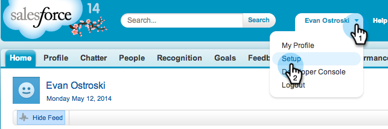
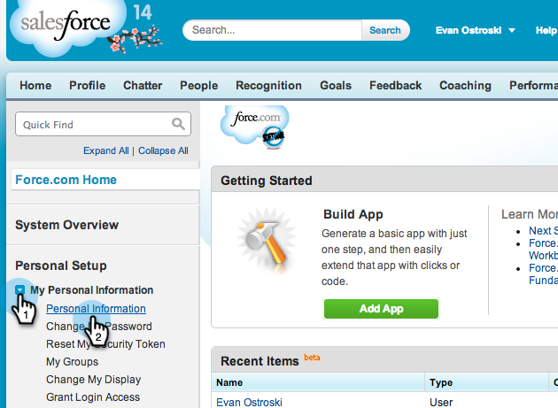
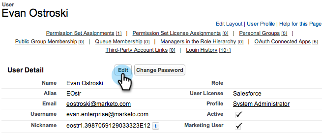
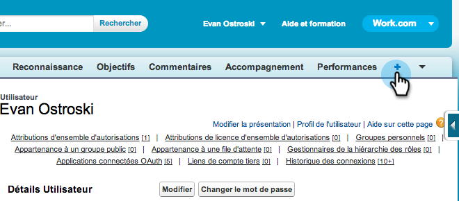
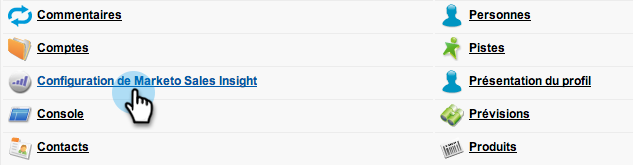
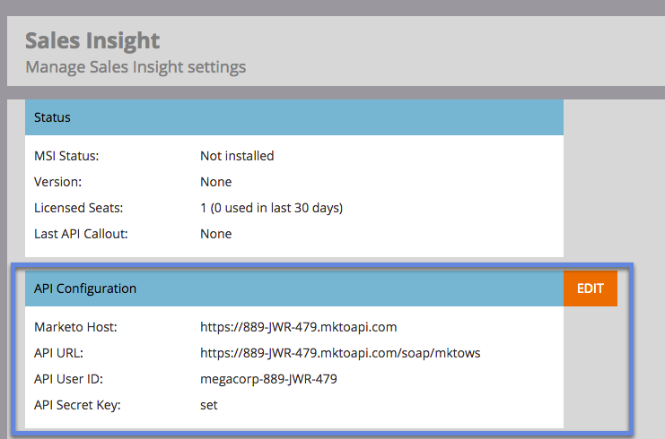
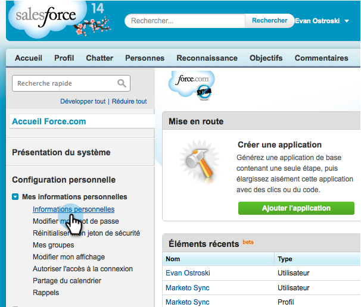
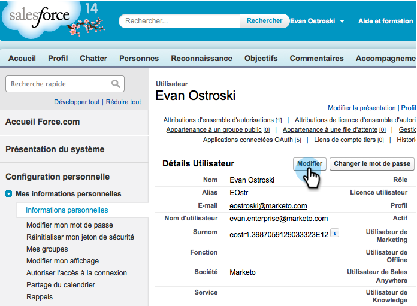
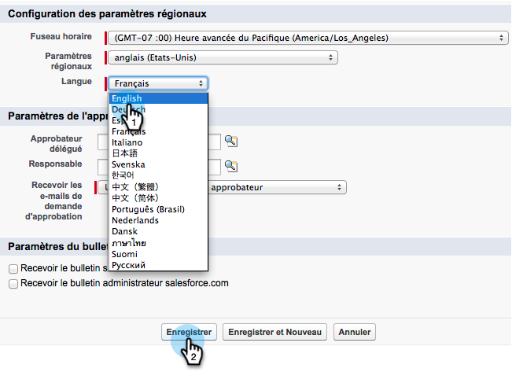

# Prepare Sales Insight for Multi-Lingual Support in Salesforce {#prepare-sales-insight-for-multi-lingual-support-in-salesforce}

>[!NOTE]
>
>**Admin Permissions Required**

Marketo Sales Insight is stored by language. So, if you want it to work for more than one language, you have to enter the credentials separately for each language.&nbsp;

>[!NOTE]
>
>Sales Insight currently supports:
>
>* English
>* French
>* German
>
>Any other language defaults to English.

### What's in this article? {#whats-in-this-article}

[Adding a New Language for Marketo Sales Insight](#adding-a-new-language-for-marketo-sales-insight)  
[Change Salesforce Back to English](#change-salesforce-back-to-english)

1. Adding a New Language for Marketo Sales Insight
1. Log in to Salesforce. In the drop-down under your name in the top right-hand corner, click **Setup**.

   

1. Under** My Personal Information**, click **Personal Information**.

   

1. Click **Edit**.

   

1. Select a language and click **Save**.

   

1. Your Salesforce interface is now in the selected language. You can click the **+** icon to see all available tabs.

   

1. Click **Configure Marketo Sales Insight **(in the selected language).

   

1. Go to Marketo. Locate your [Marketo Sales Insight **API configuration** details](https://docs.marketo.com/pages/viewpage.action?pageId=2360368#ConfigureMarketoSalesInsightinSalesforceEnterprise/Unlimited-ConfigureMarketoSalesInsight) .

   

1. Enter the API details from Marketo and click **Save**.

   

#### Change Salesforce Back to English {#change-salesforce-back-to-english}

When you are finished customizing your Salesforce organization, here's how to return your personal configuration to English.

>[!NOTE]
>
>The following screenshots are in French with instructions in English. &nbsp;You'll see the same screens with text in the language you selected in the previous step.

##### 1. Under your name, click Setup. {#under-your-name-click-setup}

1. Click **Personal Information** under **My Personal Information**.

   

1. Click **Edit**.

   

1. Select **English** from the Language drop-down and click **Save**.

   

   Now your Salesforce is back in English!

