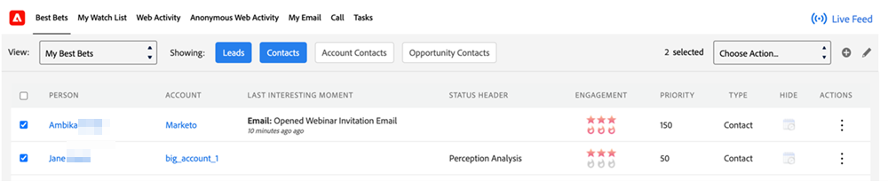

# [!DNL Best Bets] {#best-bets}

The [!DNL Best Bets] tab includes a list of all of your hot leads based on their priority, calculated using urgency and relative score.

**Filter Options**

You can click on each of the following buttons to see [!DNL Best Bets]:

* Leads: You can see [!DNL Best Bets] for all the leads assigned to you in the CRM
* Contacts: You can see [!DNL Best Bets] for all the contacts assigned to you in the CRM
* Account Contacts: You can see [!DNL Best Bets] for all contacts that belong to Accounts assigned to you in the CRM, even if the contact itself is not assigned to you
* Opportunity Contacts: You can see [!DNL Best Bets] for all contacts that belong to Opportunities assigned to you in the CRM, even if the contact itself is not assigned to you

**Things to Note**

Lead & Contact buttons are selected by default. You can select one or more filter options and a minimum of one of the four options will have to always be selected.  

You cannot “Hide” a lead or contact that you do not own.

**In-line Engagement**

By clicking the dota menu under the [!UICONTROL Actions] column, you can reach out to a specific lead or contact by using the following engagement options:

* [!UICONTROL Send Marketo Email]
* [!UICONTROL Add to Marketo Campaign]
* [!UICONTROL View in Marketo]
* [!UICONTROL Add to Watchlist]

**Bulk Actions**

You can select one or more leads or contacts from your [!DNL Best Bets] page using the checkbox and reach out to them as a group using the following engagement options:  

* [!UICONTROL Send Marketo Email]
* [!UICONTROL Add to Marketo Campaign]
* [!UICONTROL Add to Watchlist]

>[!NOTE]
>
>A contact/lead needs to be in the Default partition in order to be added to the Watchlist.
