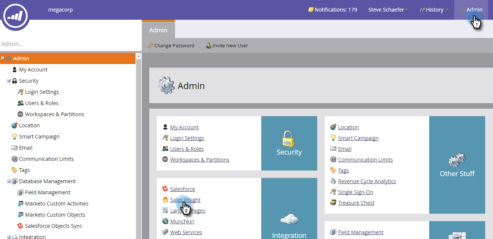
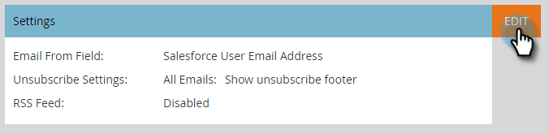
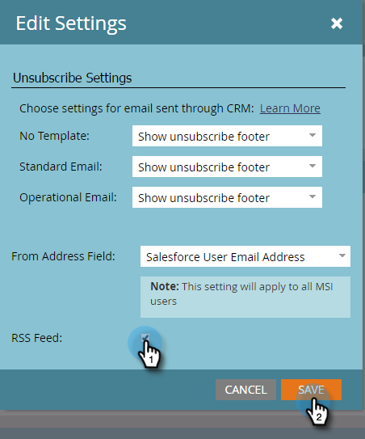
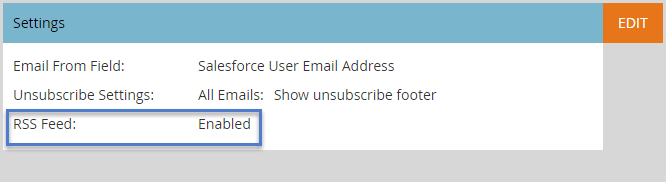

# Enable RSS for Sales Insight {#enable-rss-for-sales-insight}

>[!NOTE]
>
>**Admin Permissions Required**

If Marketo users want to view their lead feed not only in Salesforce, but also in an RSS feed, a Marketo Admin must enable it first. It's easy.

1. In My Marketo, click **Admin** and then **Sales Insight**.

   

1. On Settings, click **Edit**. Note that the RSS Feed displays as **Disabled**.

   

1. In the Edit Settings dialog box, check the **RSS feed** checkbox and click **Save**.

   

   The RSS feed now displays as **Enabled**.

   

   Piece of cake!
