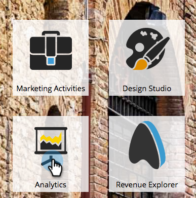
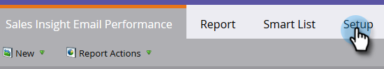
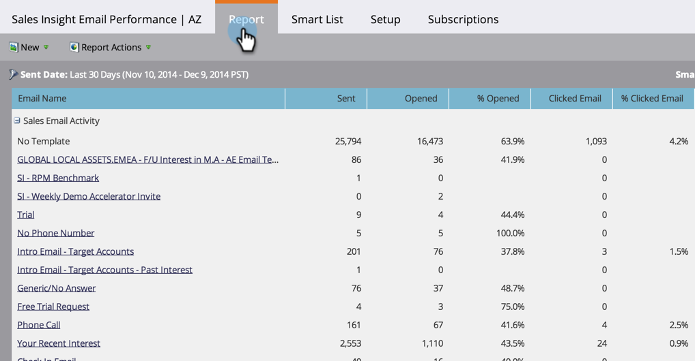
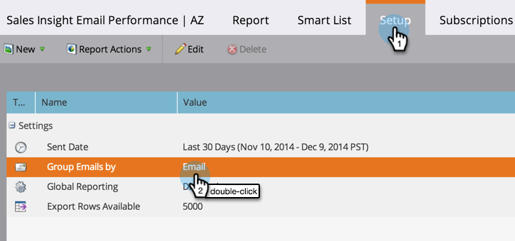
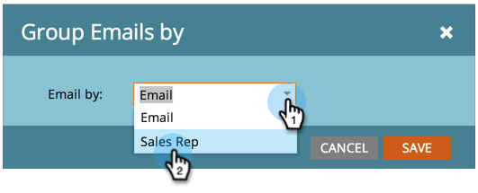

# Sales Insight Email Performance Report {#sales-insight-email-performance-report}

View the performance of emails sent through [!DNL Salesforce], [!DNL Microsoft Dynamics], or a Gmail or [!DNL Outlook] plug-in.

## Generate a Report {#generate-a-report}

1. Click **[!UICONTROL Analytics]**.

   

1. Click **[!UICONTROL Sales Insight Email Performance]**.

   

1. Click the **[!UICONTROL Setup]** tab and choose your desired values.

   

1. Click the **[!UICONTROL Report]** tab.

   

   Great! Now you can see how your emails sent from your sales team have performed.

   >[!NOTE]
   >
   >Delivered status is not captured for emails sent via Sales Insight and will not be included in this report or activity logs.

>[!TIP]
>
>Click the name of an email to open it in the Email Previewer.

## Group by [!UICONTROL Sales Rep] {#group-by-sales-rep}

You can view this report grouped by Sales rep by changing your settings.

1. Click **[!UICONTROL Setup]**. Double-click **[!UICONTROL Email]**.

   

1. Select Group Emails by **[!UICONTROL Sales Rep]**.

   

1. Click **[!UICONTROL Save]**.

   

1. Click the **[!UICONTROL Report]** tab.

   

   Pretty cool, huh? Now you can see the performance of emails grouped by sales rep.
