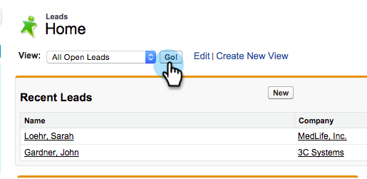
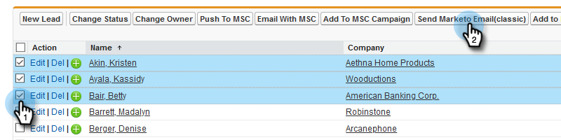
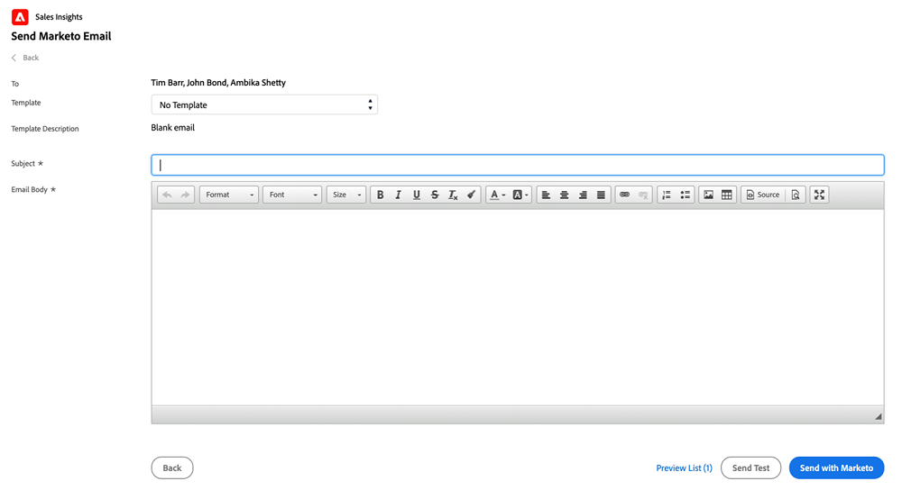

# Send an Email to Multiple Records in Marketo Sales Insight {#send-an-email-to-multiple-records-in-marketo-sales-insight}

It's super easy to send a Marketo email to multiple people using Marketo Sales Insight. Let's get started.

1. In Salesforce, click **Leads** or **Contacts**.

   

1. Click **Go** to view all open leads.

   

1. In the list view, check all leads/contacts you would like to send email to, and click **Send Marketo Email (classic)**.

   

   >[!NOTE]
   >
   >If you're using Salesforce Lightning, the button will say **Send Marketo Email (lightning)**.

   >[!TIP]
   >
   >Don't see the button? Make sure you've [added the Marketo Buttons to the list view](/help/marketo/product-docs/marketo-sales-insight/msi-for-salesforce/configuration/add-bulk-action-buttons-to-salesforce-classic.md).

1. Go ahead and compose your email. Click **Send with Marketo** when finished.

   

   >[!TIP]
   >
   >You can [publish email to Sales Insight](/help/marketo/product-docs/marketo-sales-insight/msi-for-salesforce/features/actions-in-the-msi-panel/send-marketo-email/publish-an-email-to-sales-insight.md) and choose from those emails.

   >[!NOTE]
   >
   >You can send up to 200 Marketo emails at a time.
