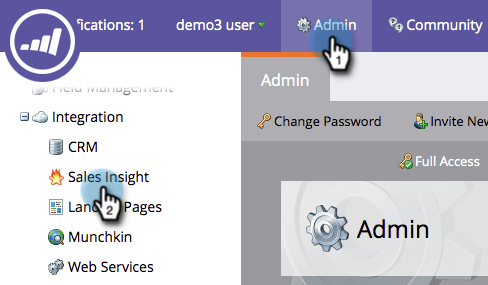
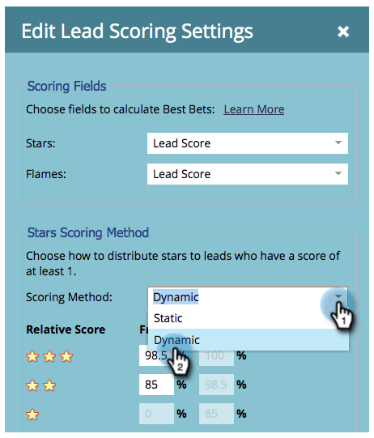
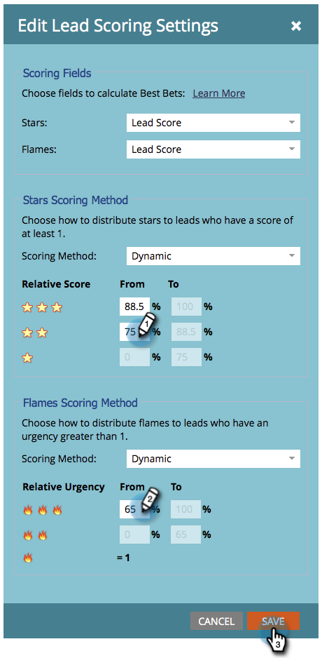

# Customize Stars and Flames {#customize-stars-and-flames}

[!DNL Marketo Sales Insight] uses stars and flames to prioritize leads. Marketo automatically decides who gets 1-2-3 stars/flames. However, you can modify the formula. Here's how:

>[!AVAILABILITY]
>
>Not all customers have purchased this functionality. Contact your sales rep for details.

>[!NOTE]
>
>**Admin Permissions Required**

1. Under [!UICONTROL Admin], click **[!UICONTROL Sales Insight]**.

1. Under the **[!UICONTROL Lead Scoring Settings]** section, click **[!UICONTROL Edit]**.

   

1. Select the **[!UICONTROL Scoring Method]** of your choice.

   >[!NOTE]
   >
   >**Definition**
   >
   >**[!UICONTROL Dynamic]** - Is a percentage value that is derived from [relative data](/help/marketo/product-docs/marketo-sales-insight/msi-for-salesforce/features/stars-and-flames/priority-urgency-relative-score-and-best-bets.md). Awesome stuff. This method is recommended.
   >
   >**[!UICONTROL Static]** - Allows you to define exact score numbers - no more percentages, no more secret sauces.

   

1. Edit the percentage brackets to your liking and **[!UICONTROL Save]**.

   >[!TIP]
   >
   >Just edit the starting percentage, Marketo will calculate the ending percentage for you!

   

>[!NOTE]
>
>Once changes are made, the process of recalculating stars and flames will take some time. Patience is a virtue.

Sweeeeeet! You just customized the way Marketo calculates stars and flames to better suit your business needs.
