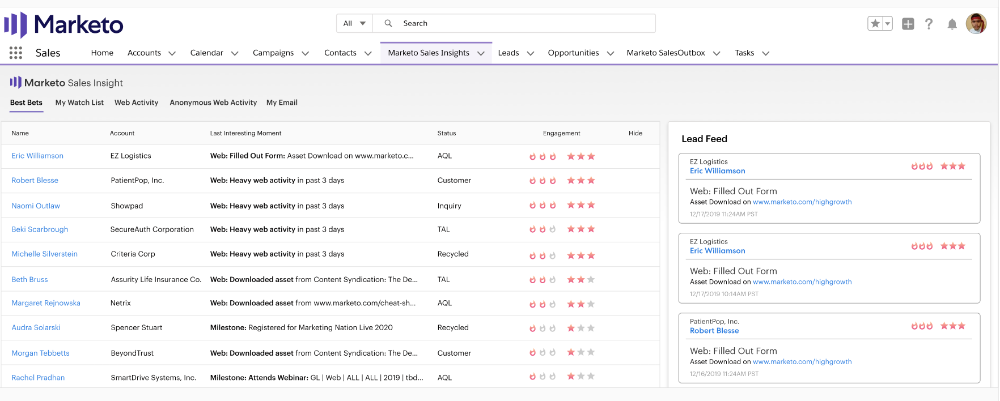

# Priority, Urgency, Relative Score, and Best Bets {#priority-urgency-relative-score-and-best-bets}

Marketo Sales Insight picks your best leads and contacts based on their priority. A lead or contact's priority has two components -- urgency and relative score.

These are derived from the lead score -- a measure of the person's interest in your product(s). The higher the score, the more likely they will respond positively to a call from your sales team.

>[!NOTE]
>
>You need several scoring campaigns to get the full value of priority, urgency, and relative score.  With too few or no scoring campaigns, these fields won't be useful.

## Urgency {#urgency}

The flames represent urgency -- how much this person's lead score has changed recently. A high urgency (more flames) means that this lead's score has increased lots lately; it's a good sign that this lead is interested in your offer. You should follow up with this person quickly!

For example, a lead who requested a demo and visited several web pages will probably have a very high urgency. A lead who didn't visit your web page or open your emails will have a low urgency. Use urgency to prioritize who needs to be contacted next.

## Relative Score {#relative-score}

The stars represent relative score -- a measure of how this person's lead score compares to everyone else's. A high relative score means this person is probably more interested and informed about your offer compared to people with lower relative scores.

If two leads have the same urgency, you can use relative score to tell which one deserves a phone call first. The one with the higher relative score may react more favorably to your offer versus the lower one.

## Best Bets {#best-bets}

Your Best Bets are your leads and contacts with the highest urgency and relative score. Only the leads you own are visible in that list, and the list is updated as lead scores change.

>[!NOTE]
>
>If your best bets don't match the best leads and contacts you own, talk with someone at your company who has access to Marketo about updating your [Scoring Rules](/help/marketo/getting-started/quick-wins/simple-scoring.md).

### How Urgency and Relative Score are Calculated

To calculate the number of stars and flames, your leads and contacts are first sorted by score or score change (for Relative Score and Urgency, respectively). Then they're divided into tiers -- the top tier receives the most stars or flames, the next receives fewer, and so on.

As scores change, urgency, priority, and relative score values are immediately recalculated. The urgency and relative score tiers are automatically calculated every night on Marketo servers.

>[!NOTE]
>
>The Relative Urgency (flames) and Relative Score (stars) count are integers in Marketo. Possible values for each are 0-3.
