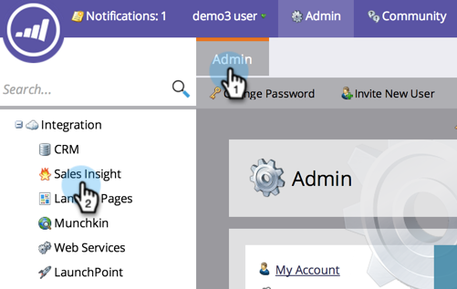
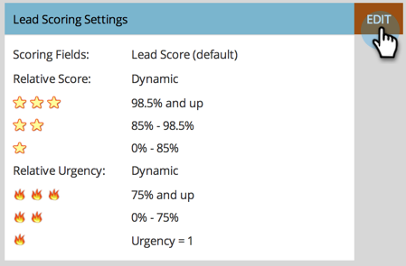
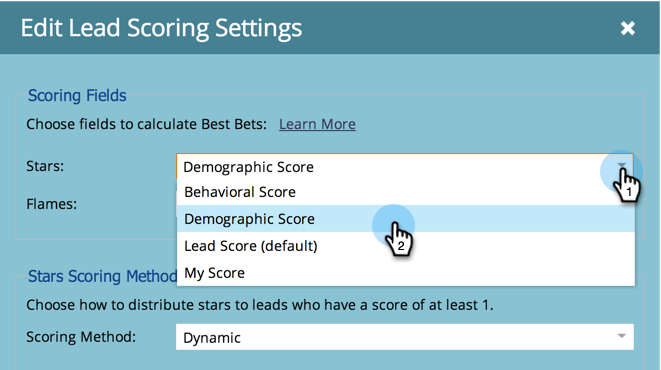
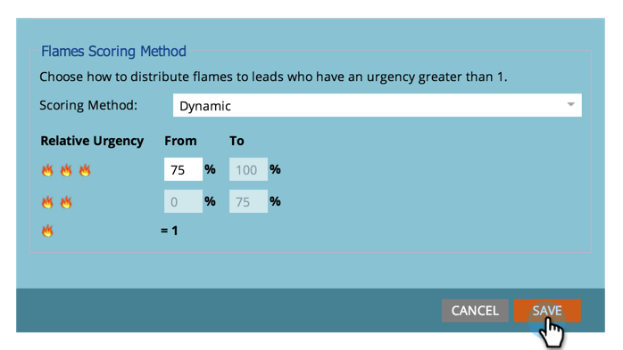

# Set Score Fields to be used for Stars and Flames in Sales Insight {#set-score-fields-to-be-used-for-stars-and-flames-in-sales-insight}

>[!NOTE]
>
>**Admin Permissions Required**

By default, Marketo Sales Insight uses the&nbsp;**Lead Score**&nbsp;field to calculate stars and flames. But if you want to pick a different field, here's how:

>[!TIP]
>
>If you don't already have your custom score fields, here's how to [create](../../../../../product-docs/administration/field-management/create-a-custom-field-in-marketo.md)them.

>[!NOTE]
>
>**Definition**
>
>* **Stars: **Stars represent total lead score compared with other leads.
>* **Flames**: Flames represent the urgency - how much a lead's score has changed recently. 
>

1. Under&nbsp;**Admin**, click on&nbsp;**Sales Insight**.

   

1. Under&nbsp;**Lead Scoring Settings**, click on&nbsp;**Edit**.

   

1. Select the field you want to use for&nbsp;**Stars**.

   

1. Select the field you want to use for **Flames**.

   

   Click&nbsp;Save.
   

   >[!NOTE]
   >
   >Sales insight will take some time to re-calculate. You can check your CRM later to see the stars and flames.

   >[!NOTE]
   >
   >**Related Articles**
   >
   >
   >[Priority, Urgency, Relative Score, and Best Bets](priority-urgency-relative-score-and-best-bets.md)

