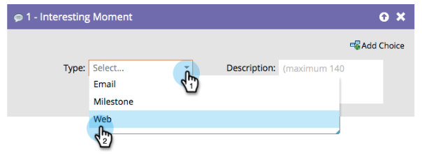

# Interesting Moments Overview {#interesting-moments-overview}

You can use the interesting moment flow step to give your sales team visibility into the cool things your leads are doing in a Smart Campaign.

1. Select the interesting moment type you want to use.

   

1. Define the text you want your sales team to see.

   

>[!TIP]
>
>**Less is more**. Work with your sales team to make sure interesting moments are actually interesting.

You can also use tokens in interesting moments to make really useful dynamic descriptions.

>[!MORELIKETHIS]
>
>* [Using Interesting Moments](/help/marketo/product-docs/marketo-sales-insight/msi-for-salesforce/features/tabs-in-the-msi-panel/interesting-moments/using-interesting-moments.md)
>* [Tokens for Interesting Moments](/help/marketo/product-docs/marketo-sales-insight/msi-for-salesforce/features/tabs-in-the-msi-panel/interesting-moments/trigger-tokens-for-interesting-moments.md)
