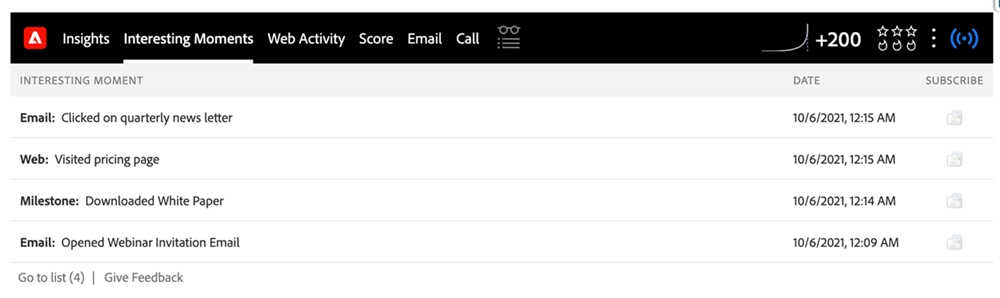
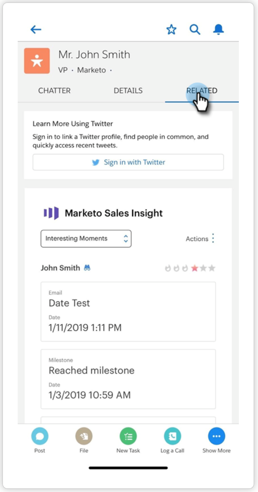
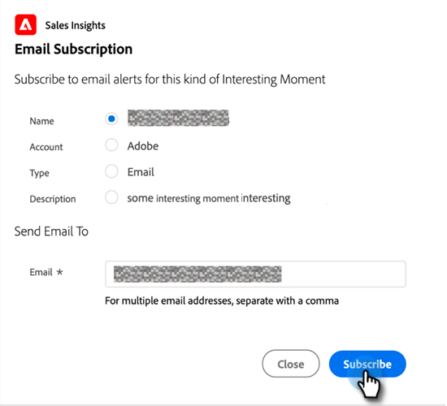

# Using Interesting Moments {#using-interesting-moments}

Interesting moments are the key to communicating with your sales team through the [!DNL Marketo Sales Insight] app.

>[!AVAILABILITY]
>
>These are available to [!DNL Marketo Sales Insight] and [[!DNL Marketo Sales Connect]](/help/marketo/product-docs/marketo-sales-connect/marketo/interesting-moments-in-sales-connect.md) customers only.

## What is an interesting moment? {#what-is-an-interesting-moment}

That's up to you! You decide what information is relevant to your sales team. Your sales team might want to know when a lead:

* Visits the pricing page on your website
* Clicks a link in a new product announcement email
* Requests a product demo

## How do I create an interesting moment?  {#how-do-i-create-an-interesting-moment}

1. Choose a [smart campaign](/help/marketo/product-docs/core-marketo-concepts/smart-campaigns/understanding-smart-campaigns.md), preferably one your sales team would find interesting if triggered.

   

1. Drag over the **[!UICONTROL Interesting Moments]** flow step.

   

1. Select a **type** ([!UICONTROL Email], [!UICONTROL Milestone], or [!UICONTROL Web]).

   

1. Write a message to your sales team in the **[!UICONTROL Description]** field that explains why this action matters.

   

   >[!NOTE]
   >
   >Marketo will also add the date it occurred and how the interesting moment was added (i.e lead action > flow step, SOAP API).

## How can this get even more interesting?  {#how-can-this-get-even-more-interesting}

Tokens! Add them in the description field to provide your sales team with more specific information like the subject line of the email the lead opened, or who was it sent by. Check out which tokens are available for use in the [Tokens for Interesting Moments](/help/marketo/product-docs/marketo-sales-insight/msi-for-salesforce/features/tabs-in-the-msi-panel/interesting-moments/trigger-tokens-for-interesting-moments.md) glossary.

>[!TIP]
>
>Start with five interesting moments, then work with your sales team to determine what information they are interested in seeing.

## What does an interesting moment look like in Marketo?  {#what-does-an-interesting-moment-look-like-in-marketo}

Interesting moments will be displayed in a [lead's activity log](/help/marketo/product-docs/core-marketo-concepts/smart-lists-and-static-lists/managing-people-in-smart-lists/using-the-person-detail-page.md).

## What does an interesting moment look like in [!DNL Salesforce]?  {#what-does-an-interesting-moment-look-like-in-salesforce}

Once you've [installed the [!DNL Marketo Sales Insight] App](/help/marketo/product-docs/marketo-sales-insight/msi-for-salesforce/configuration/configure-marketo-sales-insight-in-salesforce-enterprise-unlimited.md), interesting moments will display on the lead, contact, account, or opportunity pages. They also appear in the [!DNL Sales Insight] dashboard in the Lead Feed, [!DNL Best Bets], and Watch List.

## What does an interesting moment look like in [!DNL Salesforce1]? {#what-does-an-interesting-moment-look-like-in-salesforce-1}

After you've installed or updated [!DNL Marketo Sales Insight] for [!DNL Salesforce1], interesting moments will display under the lead's related links.

## Subscribe to Interesting Moments {#subscribe-to-interesting-moments}

You can subscribe to an Interesting Moment by clicking the [!UICONTROL Subscribe] button either in the Interesting Moment tab or in the Lead Feed. The steps below are the same for both.

1. Click the Subscribe icon. You will then be navigated to the Email Subscribe tab.

1. You can choose the type of email alert you'd like to receive based on [!UICONTROL Name], [!UICONTROL Account], [!UICONTROL Type], or [!UICONTROL Description].

1. Choose which email address(es) you'd like to send the alerts to (yourself/team members)

1. Click **[!UICONTROL Subscribe]**.

>[!NOTE]
>
>When subscribing to Interesting Moment Types or Descriptions, the user will receive email notifications for people (leads/contacts) that they own when they trigger an Interesting Moment matching that Type or Description.

