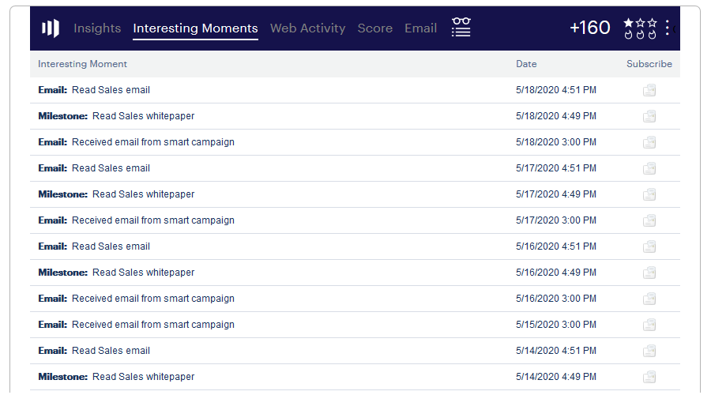

# Using Interesting Moments {#using-interesting-moments}

Interesting moments are the key to communicating with your sales team through the Marketo Sales Insight app.

>[!AVAILABILITY]
>
>These are available to Marketo Sales Insight and [Marketo Sales Connect](/help/marketo/product-docs/marketo-sales-connect/marketo/interesting-moments-in-msc.md) customers only.

## What is an interesting moment? {#what-is-an-interesting-moment}

That's up to you! You decide what information is relevant to your sales team. Your sales team might want to know when a lead:

* Visits the pricing page on your website
* Clicks a link in a new product announcement email
* Requests a product demo

## How do I create an interesting moment?  {#how-do-i-create-an-interesting-moment}

1. Choose a [smart campaign](/help/marketo/product-docs/core-marketo-concepts/smart-campaigns/understanding-smart-campaigns.md), preferably one your sales team would find interesting if triggered.

   

1. Drag over the **Interesting Moments** flow step.

   

1. Select a **type** (Email, Milestone, or Web).

   

1. Write a message to your sales team in the **Description** field that explains why this action matters.

   

   >[!NOTE]
   >
   >Marketo will also add the date it occurred and how the interesting moment was added (i.e lead action > flow step, SOAP API).

## How can this get even more interesting?  {#how-can-this-get-even-more-interesting}

Tokens! Add them in the description field to provide your sales team with more specific information like the subject line of the email the lead opened, or who was it sent by. Check out which tokens are available for use in the [Tokens for Interesting Moments](/help/marketo/product-docs/marketo-sales-insight/msi-for-salesforce/features/tabs-in-the-msi-panel/interesting-moments/tokens-for-interesting-moments.md) glossary.

>[!TIP]
>
>Start with five interesting moments, then work with your sales team to determine what information they are interested in seeing.

## What does an interesting moment look like in Marketo?  {#what-does-an-interesting-moment-look-like-in-marketo}

Interesting moments will be displayed in a [lead's activity log](/help/marketo/product-docs/core-marketo-concepts/smart-lists-and-static-lists/managing-people-in-smart-lists/using-the-person-detail-page.md).

## What does an interesting moment look like in Salesforce?  {#what-does-an-interesting-moment-look-like-in-salesforce}

Once you've [installed the Marketo Sales Insight App](/help/marketo/product-docs/marketo-sales-insight/msi-for-salesforce/configuration/configure-marketo-sales-insight-in-salesforce-enterprise-unlimited.md), interesting moments will display on the lead, contact, account, or opportunity pages. They also appear in the Sales Insight dashboard in the Lead Feed, Best Bets, and Watch List.

## What does an interesting moment look like in Salesforce1? {#what-does-an-interesting-moment-look-like-in-salesforce-1}

After you've installed or updated Marketo Sales Insight for Salesforce1, interesting moments will display under the lead's related links.

