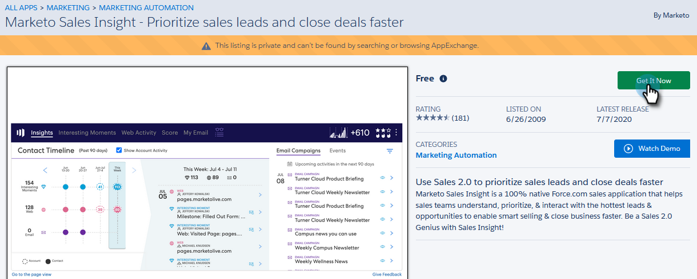
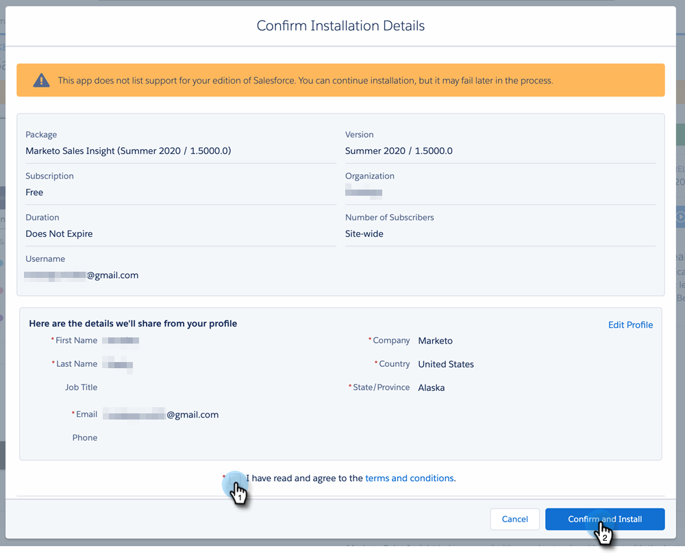
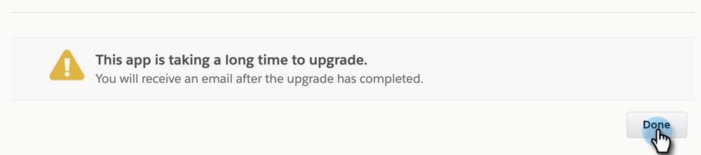
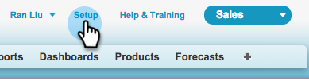
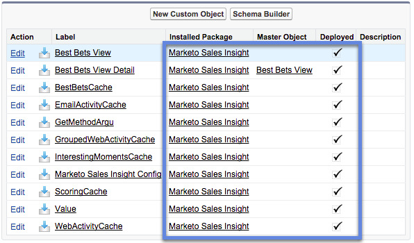
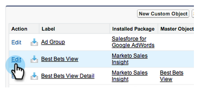

# Install Marketo Sales Insight Package in Salesforce AppExchange {#install-marketo-sales-insight-package-in-salesforce-appexchange}

You need to install the Marketo Sales Insight app in your Salesforce subscription before you can enjoy all the goodness Sales Insight provides. Here's how.

>[!NOTE]
>
>**Admin Permissions Required**

>[!NOTE]
>
>Marketo Sales Insight is compatible with Salesforce Platform (Shield) Encryption.

1. Go to the&nbsp; [AppExchange page for Marketo Sales Insight](http://appexchange.salesforce.com/listingDetail?listingId=a0N30000001SVZmEAO)&nbsp;and click&nbsp;**Get it Now**.

   

1. Click **Log in to the AppExchange** button and log in with your Salesforce credentials.
1. Enter your connected Salesforce account log-in and click **Install in Production**.

   

   >[!TIP]
   >
   >If you want to test it out in your sandbox first, choose **Install in Sandbox**.

1. Read and accept the terms and conditions, then click** Confirm and Install**.

     

1. You can choose to “Install for Admins Only” (and provide MSI access to specific profiles later), “Install for All Users,” or, “Install for Specific Profiles.”

     

1. You might see the following message once you start installation process. You will receive an email once the installation is complete. Click **Done** to dismiss.

   

1. Verify that** Marketo Sales Insight** is in the Installed Packages.

   

1. Click **Setup** next to your name.

   

1. Search for "objects", then click **Objects** under **Create**.

   

1. Double-check that **Deployed** is checked for all of Marketo Sales Insight items.

   

1. If an object is not deployed, click **Edit **next to the item.

   

1. Under **Deployment Status** section, select **Deployed**, and click **Save**. 

   

Great job! Now you've installed and deployed Marketo Sales Insight. Go ahead and configure it for your sales team and watch the sales skyrocket.

>[!NOTE]
>
>**Related Articles**
>
>[Configure Marketo Sales Insight in Salesforce Professional Edition](../../../../product-docs/marketo-sales-insight/msi-for-salesforce/configuration/configure-marketo-sales-insight-in-salesforce-professional-edition.md)
>
>[Configure Marketo Sales Insight in Salesforce Enterprise/Unlimited](../../../../product-docs/marketo-sales-insight/msi-for-salesforce/configuration/configure-marketo-sales-insight-in-salesforce-enterprise-unlimited.md)

