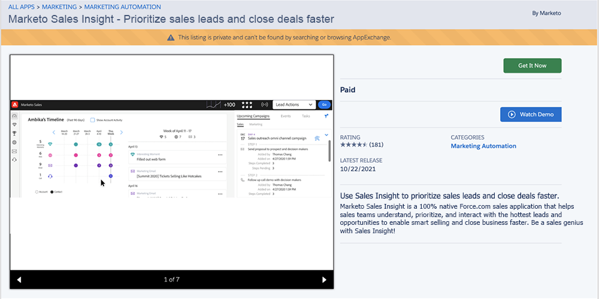
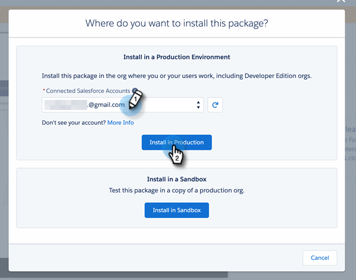
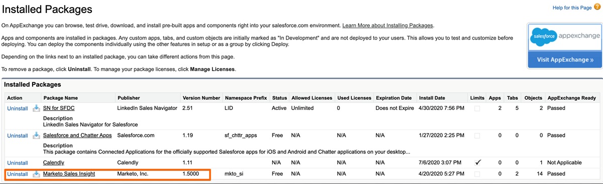
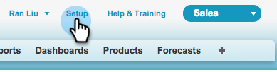

# Install [!DNL Marketo Sales Insight] Package in [!DNL Salesforce] AppExchange {#install-marketo-sales-insight-package-in-salesforce-appexchange}

You need to install the [!DNL Marketo Sales Insight] app in your [!DNL Salesforce] subscription before you can enjoy all the goodness [!DNL Sales Insight] provides. Here's how.

>[!NOTE]
>
>**Admin Permissions Required**

>[!NOTE]
>
>[!DNL Marketo Sales Insight] is compatible with [!DNL Salesforce] Platform (Shield) Encryption.

1. Go to the [AppExchange page for [!DNL Marketo Sales Insight]](https://appexchange.salesforce.com/listingDetail?listingId=a0N30000001SVZmEAO) and click **[!UICONTROL Get it Now]**.

   

1. Click **[!UICONTROL Log in to the AppExchange]** button and log in with your [!DNL Salesforce] credentials.

1. Enter your connected [!DNL Salesforce] account log-in and click **[!UICONTROL Install in Production]**.

   

   >[!TIP]
   >
   >If you want to test it out in your sandbox first, choose **[!UICONTROL Install in Sandbox]**.

1. Read and accept the terms and conditions, then click **[!UICONTROL Confirm and Install]**.

   

1. You can choose to “[!UICONTROL Install for Admins Only]” (and provide MSI access to specific profiles later), “[!UICONTROL Install for All Users],” or, “[!UICONTROL Install for Specific Profiles].”

   

1. You might see the following message once you start installation process. You will receive an email once the installation is complete. Click **Done** to dismiss.

   

1. Verify that **[!UICONTROL Marketo Sales Insight]** is in the Installed Packages.

   

1. Click **[!UICONTROL Setup]** next to your name.

   

1. Search for "objects", then click **[!UICONTROL Objects]** under **[!UICONTROL Create]**.

   

1. Double-check that **[!UICONTROL Deployed]** is checked for all of [!DNL Marketo Sales Insight] items.

   

1. If an object is not deployed, click **[!UICONTROL Edit]** next to the item.

   

1. Under **[!UICONTROL Deployment Status]** section, select **[!UICONTROL Deployed]**, and click **[!UICONTROL Save]**.

   

Great job! Now you've installed and deployed [!DNL Marketo Sales Insight]. Go ahead and configure it for your sales team and watch the sales skyrocket.

>[!MORELIKETHIS]
>
>* [Configure [!DNL Marketo Sales Insight] in [!DNL Salesforce] Professional Edition](/help/marketo/product-docs/marketo-sales-insight/msi-for-salesforce/configuration/configure-marketo-sales-insight-in-salesforce-professional-edition.md)
>* [Configure [!DNL Marketo Sales Insight] in [!DNL Salesforce] Enterprise/Unlimited](/help/marketo/product-docs/marketo-sales-insight/msi-for-salesforce/configuration/configure-marketo-sales-insight-in-salesforce-enterprise-unlimited.md)
>* [Add Sales Insight Access to Profiles](/help/marketo/product-docs/marketo-sales-insight/msi-for-salesforce/configuration/add-sales-insight-access-to-profiles.md){target="_blank"}
