# Install and Configure [!DNL Marketo Sales Insight] in [!DNL Salesforce1] {#install-and-configure-marketo-sales-insight-in-salesforce}

>[!NOTE]
>
>Existing customers, please [Upgrade Your MSI Package](/help/marketo/product-docs/marketo-sales-insight/msi-for-salesforce/upgrading/upgrading-your-msi-package.md) before you continue!

>[!PREREQUISITES]
>
>If you have Salesforce Enterprise/Unlimited:
>
>* [Step 1 of 3: Add Marketo Fields to [!DNL Salesforce] (Enterprise/Unlimited)](/help/marketo/product-docs/crm-sync/salesforce-sync/setup/enterprise-unlimited-edition/step-1-of-3-add-marketo-fields-to-salesforce-enterprise-unlimited.md)
>* [Step 2 of 3: Create a [!DNL Salesforce] User for Marketo (Enterprise/Unlimited)](/help/marketo/product-docs/crm-sync/salesforce-sync/setup/enterprise-unlimited-edition/step-2-of-3-create-a-salesforce-user-for-marketo-enterprise-unlimited.md)
>* [Step 3 of 3: Connect Marketo and [!DNL Salesforce] (Enterprise/Unlimited)](/help/marketo/product-docs/crm-sync/salesforce-sync/setup/enterprise-unlimited-edition/step-3-of-3-connect-marketo-and-salesforce-enterprise-unlimited.md)
>* [Configure [!DNL Marketo Sales Insight] in [!DNL Salesforce] Enterprise/Unlimited](/help/marketo/product-docs/marketo-sales-insight/msi-for-salesforce/configuration/configure-marketo-sales-insight-in-salesforce-enterprise-unlimited.md)
>
>If you have Salesforce Professional:
>
>* [Configure Marketo Sales Insight in Salesforce Professional Edition](/help/marketo/product-docs/marketo-sales-insight/msi-for-salesforce/configuration/configure-marketo-sales-insight-in-salesforce-professional-edition.md)
>

>[!NOTE]
>
>[!DNL Marketo Sales Insight] in [!DNL Salesforce1] includes: [!DNLBest Bets], Lead Feed, Interesting Moments, and Add to Marketo Campaign.

## Enable the [!DNL Salesforce1] Mobile App {#enable-the-salesforce1-mobile-app}

1. Click **[!DNL Setup]** and then **[!DNL Mobile Administration]**.

   

1. Click **[!UICONTROL Salesforce1]**.

   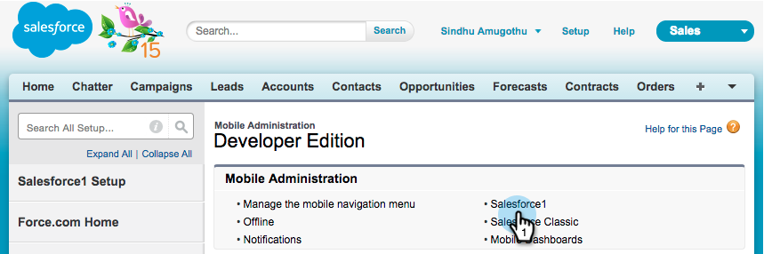

1. Click **[!UICONTROL Salesforce1 Settings]**.

   

1. Click **[!UICONTROL Enable the Salesforce1 mobile browser app]**.

   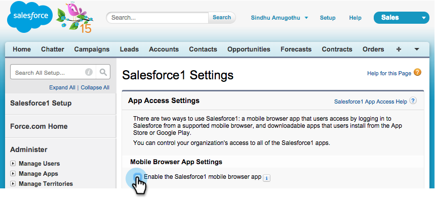

1. Click **[!UICONTROL Save]**.

   

1. Select **[!UICONTROL Mobile Administration]**.

   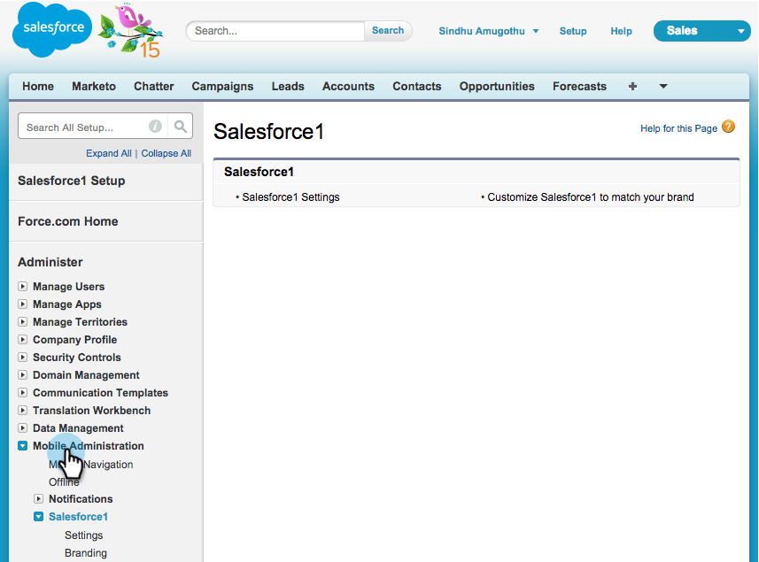

1. Click **[!UICONTROL Manage the mobile navigation menu]**.

   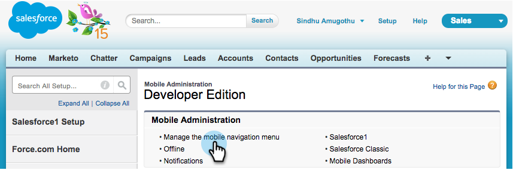

1. Select **[!UICONTROL Marketo]** and **[!UICONTROL Add]** it to the **[!UICONTROL Selected]** menu items.

   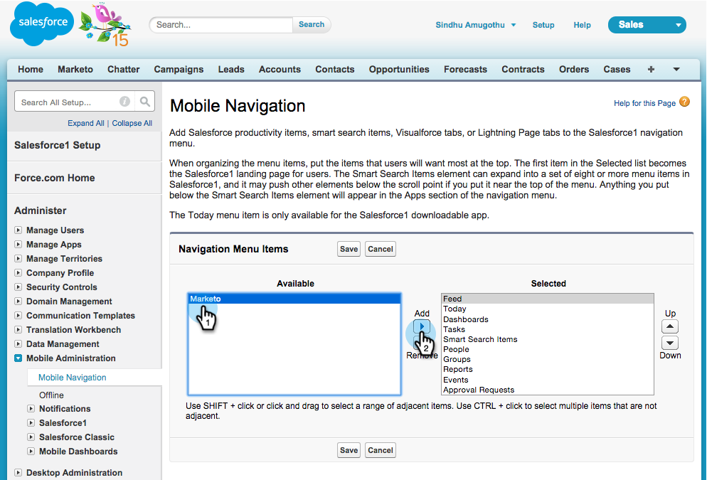

1. Select **[!UICONTROL Marketo]**, move it **[!UICONTROL Up]** to a desired area, and click **[!UICONTROL Save]**.

   

## Hide Outdated Marketo Custom Object {#hide-outdated-marketo-custom-object}

1. Click **[!UICONTROL Setup]**.

   

1. Select **[!UICONTROL Manage Users]**.

   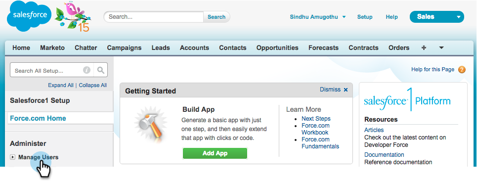

1. Select **[!UICONTROL Profiles]**.

   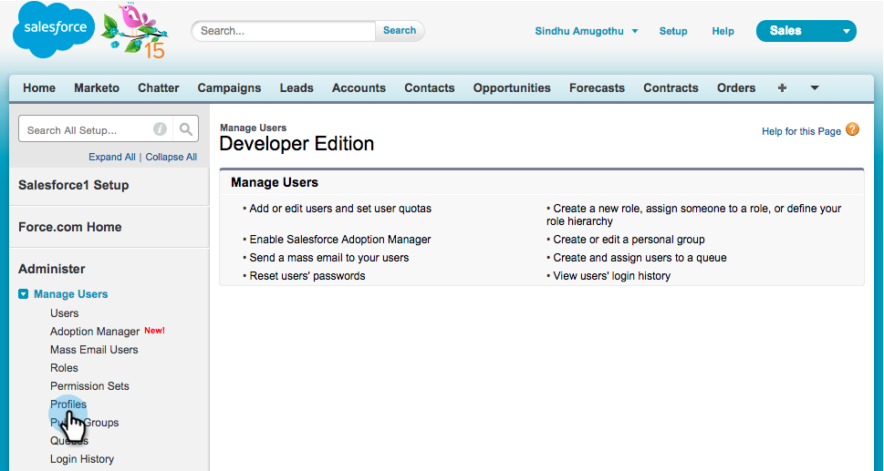

1. Click to **[!UICONTROL Edit]** any desired profiles.

   

1. Under **[!UICONTROL Tab Settings]**, select the _first_ **[!UICONTROL Marketo]**.

   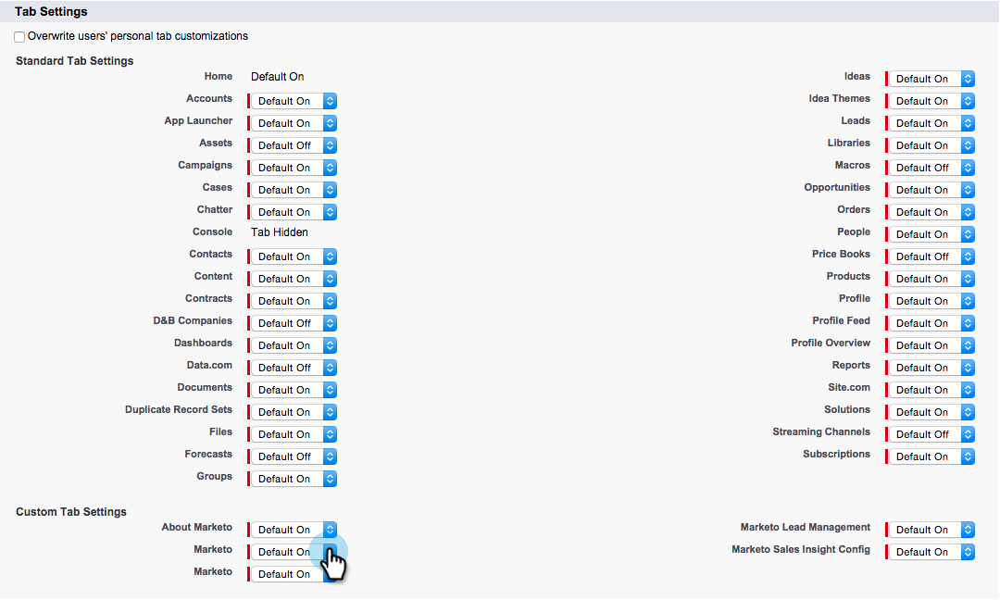

1. Select **[!UICONTROL Tab Hidden]**.

   

   >[!NOTE]
   >
   >Make sure to hide the Marketo tab for all desired profiles!

## Customize Tabs {#customize-tabs}

1. Click **+**.

   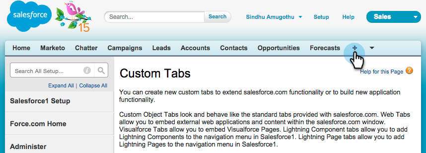

1. Click **[!UICONTROL Customize My Tabs]**.

   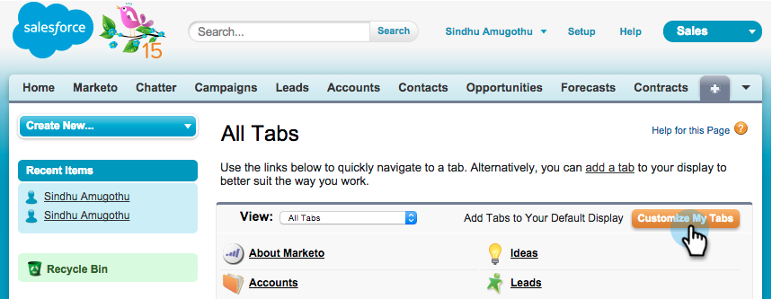

1. Select **[!UICONTROL Marketo]** and **[!UICONTROL Add]** it to the Selected Tabs.

   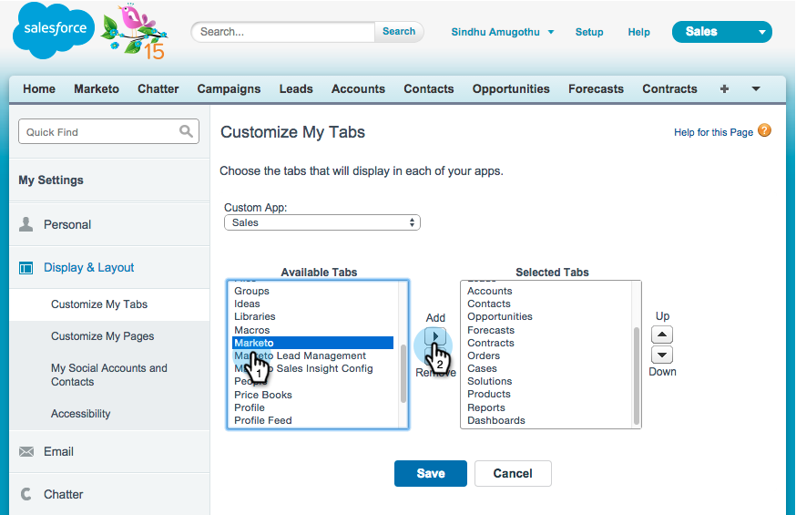

1. Select **[!UICONTROL Marketo]**, move it **[!UICONTROL Up]** to a desired area, and click **[!UICONTROL Save]**.

   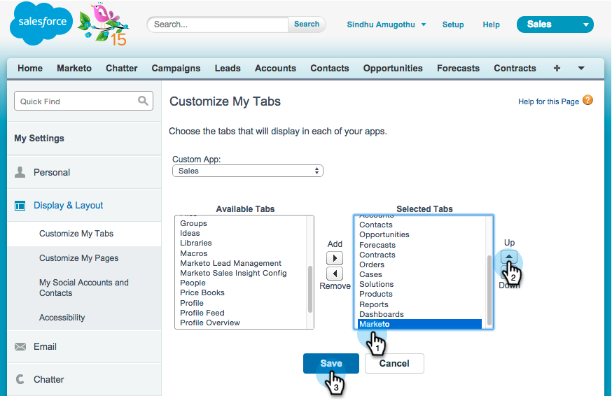

## Customize Page Layouts {#customize-page-layouts}

1. Click **[!UICONTROL Setup]**.

   

1. Click **[!UICONTROL Setup]**, type **[!UICONTROL Page Layouts]**, and click **[!UICONTROL Page Layouts]** under Leads.

   >[!NOTE]
   >
   >Repeat the steps for every Page Layout that your organization uses (marketing, sales, etc.) for Contact, Account, and Opportunity objects.

   

1. Click **[!UICONTROL Edit]** to make changes to the Lead Layout.

   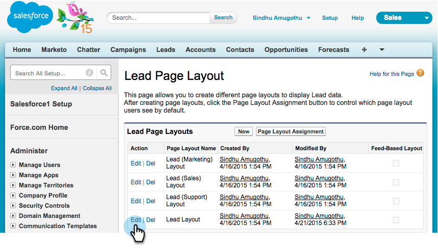

1. Click **[!UICONTROL Visualforce Pages]** and then drag **[!UICONTROL Lead Mobile]** to the Mobile Cards section.

   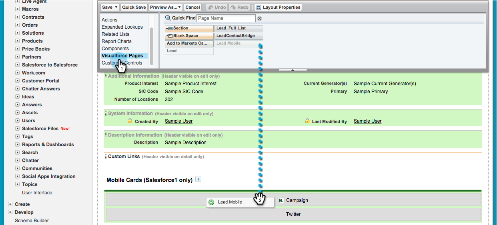

1. Change the Height to 66 and click **[!UICONTROL OK]**.

   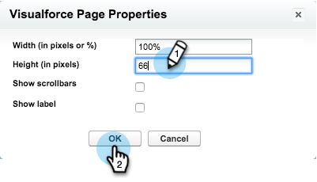

1. Click **[!UICONTROL Fields]** and drag **[!UICONTROL Add to Marketo Campaign]** to the **[!UICONTROL Marketo Sales Insight]** section.

   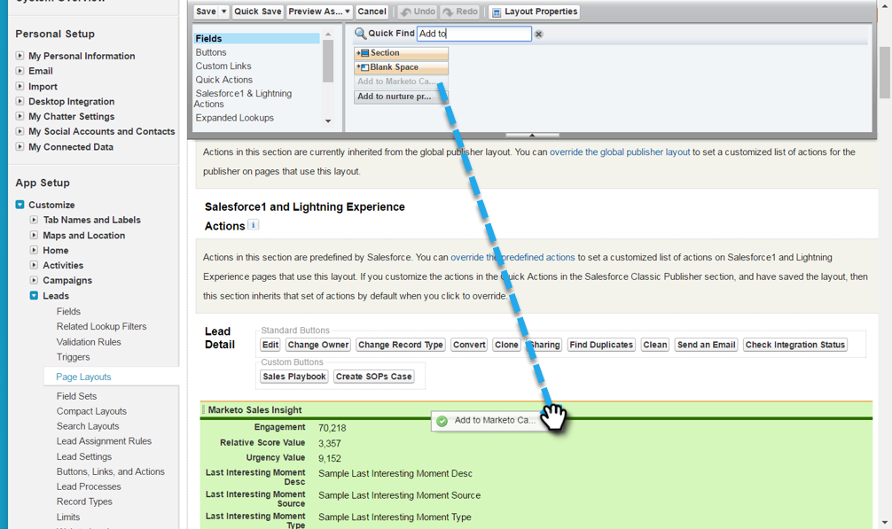

   >[!TIP]
   >
   >Type "Add to" into the Quick Find to make Add to Marketo Campaign easy to find.

1. Click **[!UICONTROL Save]**.

   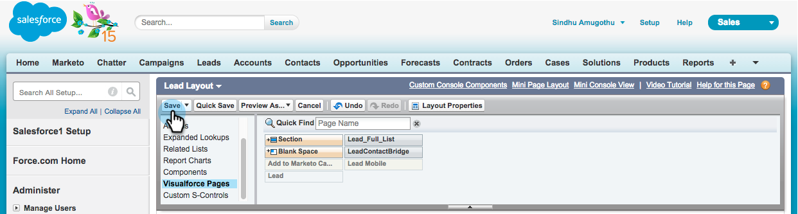

Phew! You're finally done installing [!DNL Marketo Sales Insight] for [!DNL Salesforce1]! Go ahead and give yourself a pat on the back.

>[!MORELIKETHIS]
>
>* [[!DNL Best Bets] in [!DNL Salesforce1]](/help/marketo/product-docs/marketo-sales-insight/msi-for-salesforce/msi-for-mobile/best-bets-in-salesforce1.md)
>* [Interesting Moments in [!DNL Salesforce1]](/help/marketo/product-docs/marketo-sales-insight/msi-for-salesforce/msi-for-mobile/interesting-moments-in-salesforce1.md)
>* [Send Marketo Email and Campaign and Watchlist Actions in [!DNL Salesforce1]](/help/marketo/product-docs/marketo-sales-insight/msi-for-salesforce/msi-for-mobile/send-marketo-email-and-campaign-and-watchlist-actions-in-salesforce1.md)
