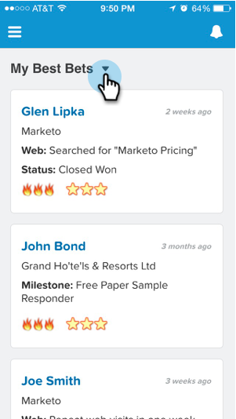
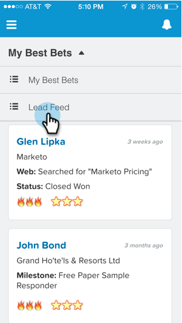
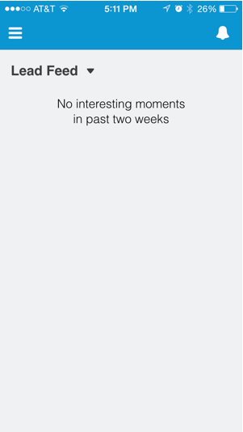

# Seeing Lead Feed in Salesforce1 {#seeing-lead-feed-in-salesforce}

The Lead Feed is an up-to-the-minute list of interesting events done by your leads.

1. Go to the **Marketo** area in Salesforce1.

   

1. Tap the down arrow.

   

1. Tap **Lead Feed**.

   

   Perfect! Now you know how to get to your Lead Feed!

   

>[!MORELIKETHIS]
>
>* [Interesting Moments in Salesforce1](/help/marketo/product-docs/marketo-sales-insight/msi-for-salesforce/msi-for-mobile/interesting-moments-in-salesforce1.md)
>* [Send Marketo Email and Campaign and Watchlist Actions in Salesforce1](/help/marketo/product-docs/marketo-sales-insight/msi-for-salesforce/msi-for-mobile/send-marketo-email-and-campaign-and-watchlist-actions-in-salesforce1.md)
>* [Best Bets in Salesforce1](/help/marketo/product-docs/marketo-sales-insight/msi-for-salesforce/msi-for-mobile/best-bets-in-salesforce1.md)
