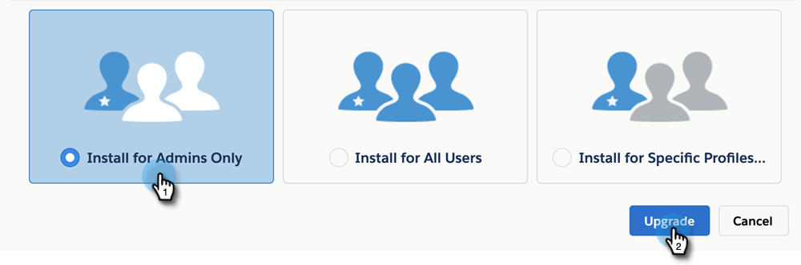

# Upgrading Your MSI Package {#upgrading-your-msi-package}

>[!IMPORTANT]
>
>Due to security enhancements made by Salesforce, the Sales Insight package can no longer grant permission to standard objects. Going forward, the Salesforce profile of Sales Insight users will need to have read access to the following standard objects: lead, contact, account, and opportunity. [Learn how to configure that here](/help/marketo/product-docs/marketo-sales-insight/msi-for-salesforce/configuration/configure-marketo-sales-insight-in-salesforce-professional-edition.md#grant-sales-insight-users-profile-access){target="_blank"}.

1. Navigate to [this page in the appexchange](https://appexchange.salesforce.com/listingDetail?listingId=a0N30000001SVZmEAO){target="_blank"}.

1. Log in to your Salesforce instance (the one connected to your Marketo instance, can be sandbox or production) from the top-right corner in the page from Step One. You must have Admin privileges to install/upgrade a managed package in Salesforce.

1. Click the **Get It Now** button. You'll be asked to choose where you'd like to install. You'll be given the option to upgrade since you already have a previous version of MSI. Choose an option based on the account you logged into during Step One.

   >[!TIP]
   >
   >We recommend you test this on your sandbox instance before upgrading your production instance.

1. You can upgrade the package by choosing "Install for Admins Only" (and provide MSI access to specific profiles later), "Install for All Users," or, "Install for Specific Profiles." In this example we're choosing Admins Only. When you've made your selection, click **Upgrade**.

   

>[!NOTE]
>
>It is recommended you update the package for Admins only and then [provide access to specific users](/help/marketo/product-docs/marketo-sales-insight/msi-for-salesforce/configuration/add-sales-insight-access-to-profiles.md){target="_blank"} based on the number of MSI seats purchased. Alternatively, you can create a specific Salesforce profile for MSI users and install or upgrade the package for those users only.
