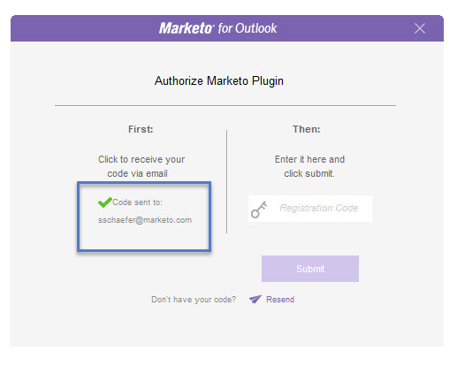
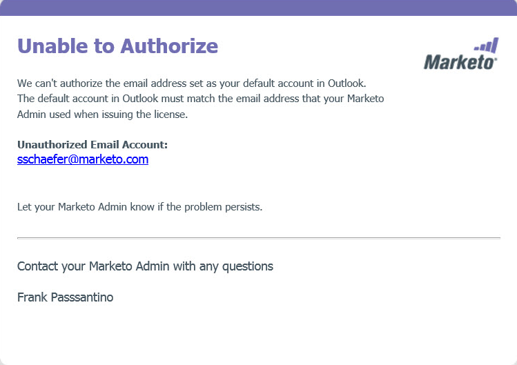

# Authorize the Marketo Outlook Plugin {#authorize-the-marketo-outlook-plugin}

To use the Marketo MSI plugin in Outlook, you need to authorize it.

>[!PREREQUISITES]
>
>The plugin must already be installed and you must be authorized as a plugin user by your Marketo Admin.

>[!IMPORTANT]
>
>Microsoft has released a [new version of Outlook for Windows](https://techcommunity.microsoft.com/t5/outlook-blog/new-outlook-for-windows-now-available/ba-p/3932068){target="_blank"}. This new version does not support the existing MSI Outlook plugin. The MSI Outlook plugin will continue to work for Windows desktops running the classic version of Outlook. To learn more about the new Outlook for Windows for organizations, [click here](https://techcommunity.microsoft.com/t5/outlook-blog/the-new-outlook-for-windows-for-organization-admins/ba-p/3929169){target="_blank"}.

1. Click either of the Marketo Message buttons.

   

1. When the Authorize Marketo Plugin dialog appears, click **Request Code**.

   

1. The code is sent to your default Outlook account email address.

   

1. If your default Outlook account email address checks out, you will receive a registration key. Enter it in the pop-up and click **Submit**.

   

   >[!NOTE]
   >
   >The registration code **expires after 14 days.**

1. If the email address is not authorized, you'll receive this less happy email. Contact your Marketo Admin to resolve the problem.

   
