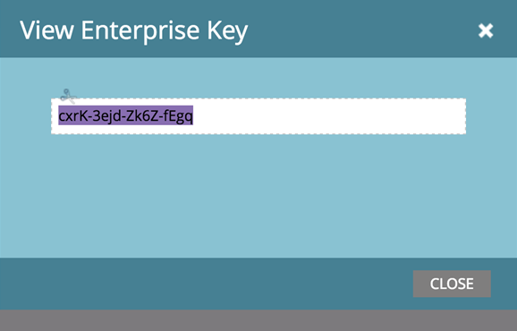

# Install the Marketo Add-in for Outlook with an Enterprise Key {#install-the-marketo-add-in-for-outlook-with-an-enterprise-key}

Many times, sales reps don't have administrative privileges on their laptops, and their IT teams are responsible for installing all software remotely. The Marketo Add-in for Outlook can be installed this way using your Enterprise Key, which can be found in the Sales Insight section of Admin.

>[!NOTE]
>
>**Prerequisites**
>
>The admin must have [issued a Marketo Email Add-In License](issue-a-marketo-email-add-in-license.md).

>[!NOTE]
>
>If you don't see the View Enterprise Key button, contact [`[email protected]`](http://docs.marketo.com/cdn-cgi/l/email-protection#87f4f2f7f7e8f5f3c7eae6f5ece2f3e8a9e4e8ea) to enable it.

1. In My Marketo, click **Admin **and then** Sales Insight.**

   

1. Click the **Email Add-In** tab.

   

1. Click **View Enterprise Key**.

   

1. Copy the Outlook Enterprise License Key and paste it into an email, along with [this link](marketo-outlook-plugin-installation-by-it.md), and send it to your IT department for remote installation.

   

   That's all! Next, the sales rep will go through the [registration process](authorize-the-marketo-outlook-plugin.md). You can send them a link to the instructions (see **Marketo Related Articles**).

   >[!NOTE]
   >
   >**Related Articles**
   >
   >    
   >    
   >    * [Authorize the Marketo Outlook Plugin](authorize-the-marketo-outlook-plugin.md)
   >    
   >

