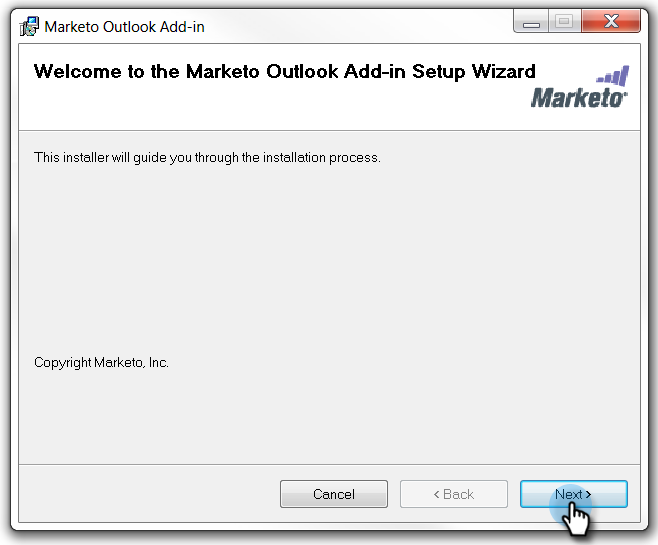
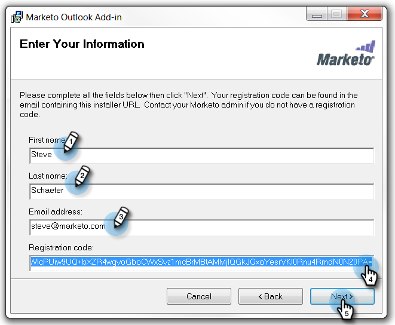
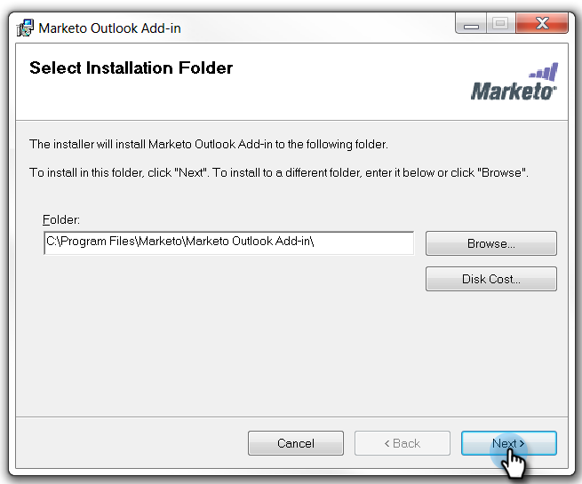
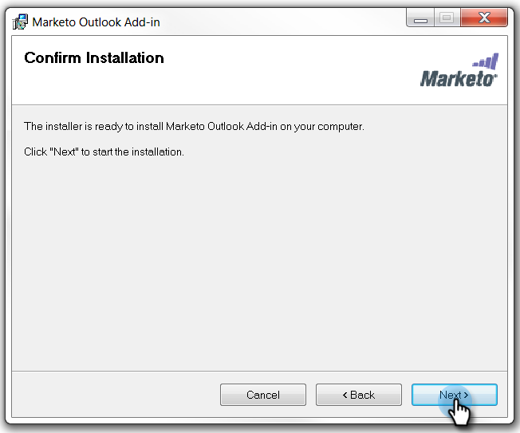

# Install the Marketo Email Add-in for Outlook with a Registration Code {#install-the-marketo-email-add-in-for-outlook-with-a-registration-code}

If users can access the admin settings on their laptops, you can send a registration code to them directly.

If you haven't received an invite email, ask your Marketo administrator to invite you.

>[!PREREQUISITES]
>
>You must be [issued a Marketo Email Add-in License](/help/marketo/product-docs/marketo-sales-insight/msi-outlook-plugin/issue-a-marketo-email-add-in-license.md).

>[!IMPORTANT]
>
>Installation is not supported on PCs where the Windows User folder contains non-English characters. This folder is generated automatically by Windows under `<System Root>\Users\` based on the Windows User name and may contain non-English characters if the Windows User name is a non-English name. Please work with your IT team to verify if you're encountering installation issues.

>[!NOTE]
>
>Sales Insight Actions capabilities, including Send Sales Email, Add to Sales Campaign, and Tasks, are not available in the Sales Insight email plugins for Gmail and Outlook. At this time, users only have the ability to send a trackable email with or without a Marketo email template from their email client when using the Sales Insight email plugins.

## Download Installer {#download-installer}

1. Identify your [Microsoft Outlook version](https://support.office.com/en-us/article/what-version-of-outlook-do-i-have-b3a9568c-edb5-42b9-9825-d48d82b2257c){target="_blank"}

1. Click the link to download the installer appropriate for your version of Microsoft Outlook.

   >[!NOTE]
   >
   >At this time, the links below are only working in Microsoft Edge, or by right-clicking in Chrome. Sorry for any inconvenience.

   | Outlook Version |32-bit Outlook |64-bit Outlook |
   |---|---|---|
   | Outlook 2000 |Not Supported |N/A |
   | Outlook 2003 | [Download](https://munchkin.marketo.net/MarketoAddInSetup32.msi) |N/A |
   | Outlook 2007 | [Download](https://munchkin.marketo.net/MarketoAddInSetup32.msi) |N/A |
   | Outlook 2010 | [Download](https://munchkin.marketo.net/MarketoAddInSetup32.msi) | [Download](https://munchkin.marketo.net/MarketoAddInSetup64.msi) |
   | Outlook 2013 | [Download](https://munchkin.marketo.net/MarketoAddInSetup32.msi) | [Download](https://munchkin.marketo.net/MarketoAddInSetup64.msi) |
   | Outlook 2016 | [Download](https://munchkin.marketo.net/MarketoAddInSetup32.msi) | [Download](https://munchkin.marketo.net/MarketoAddInSetup64.msi) |
   | Outlook 2019 | [Download](https://munchkin.marketo.net/MarketoAddInSetup32.msi) | [Download](https://munchkin.marketo.net/MarketoAddInSetup64.msi) |
   | Outlook for Mac |Not Supported |Not Supported |
   | Outlook Web App |Not Supported |Not Supported |
   | Office 365* | [Download](https://munchkin.marketo.net/MarketoAddInSetup32.msi) | [Download](https://munchkin.marketo.net/MarketoAddInSetup64.msi) |

   *Office 365 version: Windows client only (on Windows 10, Enterprise or Pro).

## Copy Your Registration Code {#copy-your-registration-code}

1. Copy the registration code from the invite email you received.

   

1. Close Microsoft Outlook.

   

## Install {#install}

1. Run the installer.

   

   >[!NOTE]
   >
   >If you get a security warning, don't worry! Just click **Run**.

1. Click **Next**.

   

1. Fill in **First Name**, **Last Name**, **Email Address**, then copy and paste the **Registration code** from the email into the form and click **Next**.

   

   >[!TIP]
   >
   >If the install fails, check with your IT department to ensure that HTTPS traffic is not blocked. The installer requires HTTPS traffic to be open.

1. Click **Next** to install in the default location.

   

1. Click **Next**.

   

   >[!NOTE]
   >
   >If you get a security prompt about an unknown publisher, click **Yes**.

1. The installation is now complete, click **Close**.

   

1. Now open Microsoft Outlook and see the Marketo buttons.

   

   Excellent! Now the Marketo buttons are in a better place.

Learn more about using the Marketo Message and Log With Marketo actions.

>[!MORELIKETHIS]
>
>* [Send and Track an Email with the Marketo Email Add-in for Outlook](/help/marketo/product-docs/marketo-sales-insight/msi-outlook-plugin/send-and-track-an-email-with-the-email-add-in-for-outlook.md){target="_blank"}
>* [Send and Track from Outlook Using a Marketo Template](/help/marketo/product-docs/marketo-sales-insight/msi-outlook-plugin/send-and-track-from-outlook-using-a-marketo-template.md){target="_blank"}
