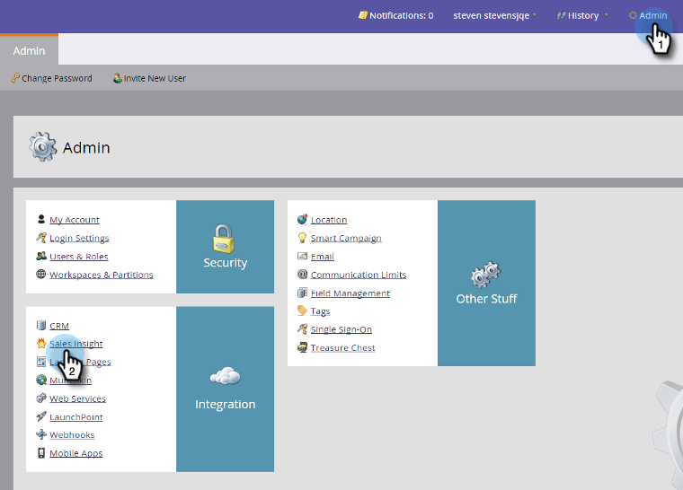
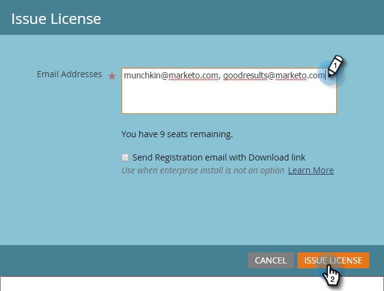

# Issue a Marketo Email Add-in License {#issue-a-marketo-email-add-in-license}

Anyone who wants to use the Marketo Email Outlook Add-in must first be issued a license. There are two ways to provide the license.

* **[Enterprise Key Installation](install-the-marketo-add-in-for-outlook-with-an-enterprise-key.md)**: Use this method when the sales reps don't have admin rights to their corporate laptops and can't install plugins, software, etc. on it. In this case, the Marketo Admin issues licenses to a list of authorized users. Next, the IT team remotely deploys the plugin to all authorized users' computers using the Enterprise Key. The plugin user then authorizes it. 
* **[Registration Code Installation](install-the-marketo-email-add-in-for-outlook-with-a-registration-code.md)**: Use this method when sales reps do have admin rights to their corporate laptop and can install plugins, software, etc. on it. For this process, the Marketo admin issues licenses to a list of authorized users and sends them registration emails directly with download links. The sales rep receives an email with a plugin download link and a unique registration URL.

>[!AVAILABILITY]
>
>
>Not all customers have purchased this functionality. Contact your sales rep for details. 

>[!NOTE]
>
>**Admin Permissions Required**

1. In My Marketo, click Admin and then Sales Insight.

1. Under the **Email Add-in **tab, click **Issue License**.

   

1. Enter the sales reps' email addresses that need to be authorized to use the plugin and click **Issue License**.

   >

   >[!TIP]
   >
   >You can enter multiple email addresses, separated by a comma. 

   >[!NOTE]
   >
   >To install the plugin remotely, leave the checkbox unchecked and send your IT team your [Enterprise Key](http://docs.marketo.com/display/DOCS/Install+the+Marketo+Add-in+for+Outlook+with+an+Enterprise+Key).
   >
   >If your sales reps have admin access to their computers, check the box and you're done!

>[!MORELIKETHIS]
>
>* [Install the Marketo Add-in for Outlook with an Enterprise Key](install-the-marketo-add-in-for-outlook-with-an-enterprise-key.md)
>* [Install the Marketo Email Add-in for Outlook with a Registration Code](install-the-marketo-email-add-in-for-outlook-with-a-registration-code.md)
>* [Upgrade your Marketo Email Add-In for Outlook](upgrade-your-marketo-email-add-in-for-outlook.md)
