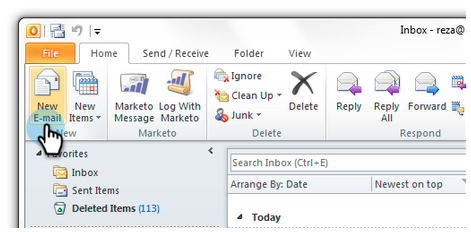
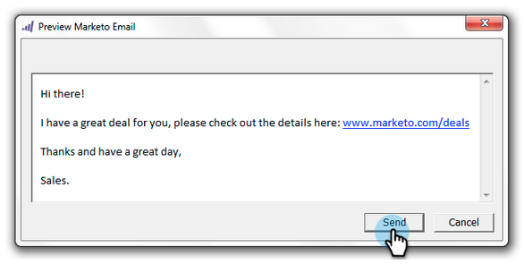
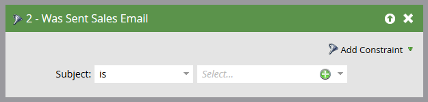

# Send and Track an Email with the Email Add-In for Outlook {#send-and-track-an-email-with-the-email-add-in-for-outlook}

You can send and track emails with Marketo directly from Outlook.

>[!NOTE]
>
>**Prerequisites**
>
>If you haven't yet, install the [Marketo email add-in for Outlook](install-the-marketo-email-add-in-for-outlook-with-a-registration-code.md).

1. Open Microsoft Outlook and create a new email.

   

   >[!CAUTION]
   >
   >If you include multiple recipients in the email, all activity will be tracked under the first recipient.

1. Compose your email as you normally would, then click **Send and Track**.

   

   >[!NOTE]
   >
   >If you send an email to someone who doesn't exist in your Marketo instance, a Person Record will automatically be created for them. Their last name will always be 'mktUnknown' so that you can easily find them.

   >[!TIP]
   >
   >If you want to use a Marketo template, see [Send and Track from Outlook Using a Template](send-and-track-from-outlook-using-a-marketo-template.md).

1. Take a look at the preview and click **Send**.

   

   >[!CAUTION]
   >
   >Anti-spam technology often rejects opens and clicks that happen within 20 seconds of sending the email, so please wait at least that long to open/click while testing.

   In order to see who has received your emails sent through Outlook, create a smart list using the "Was Sent Sales Email" filter.

   

It's that easy! Even though this email was sent by a salesperson's Outlook, it will be tracked in Marketo. 

>[!NOTE]
>
>**Related Articles**
>
>* [Log Inbound Mail From Your Leads in Marketo](../../../product-docs/marketo-sales-insight/using-msi/log-inbound-mail-from-your-leads-in-marketo.md)
>

