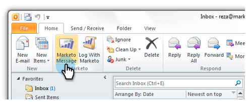
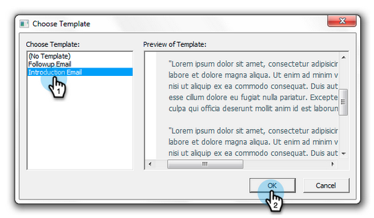
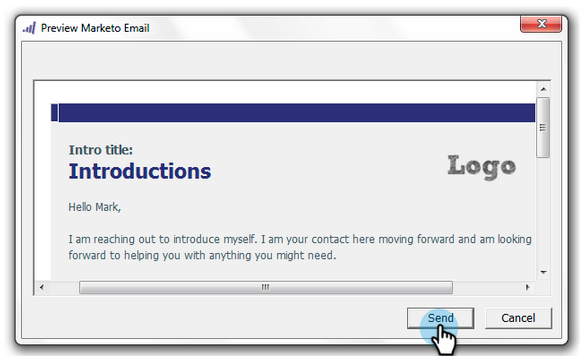

# Send and Track from Outlook Using a Marketo Template {#send-and-track-from-outlook-using-a-marketo-template}

If your marketing team has made templates available to you, here's how you can use them to save time when composing your emails.

1. Open Microsoft Outlook and click **Marketo Message**.

   

1. Select the template you want, preview it, and click **OK**.

   

1. Make all your edits, then click **Send and Track**.

   

   >[!NOTE]
   >
   >Tokens are not supported with the add-in. Remove any that might be in the template.

1. Check out the preview, make sure it looks good, then click **Send**.

   

   And there you go! You were able to save a bunch of time by using templates that your super awesome marketing team made for you.

>[!MORELIKETHIS]
>
>[Log Inbound Mail From Your Leads in Marketo](/help/marketo/product-docs/marketo-sales-insight/using-msi/log-inbound-mail-from-your-leads-in-marketo.md)
