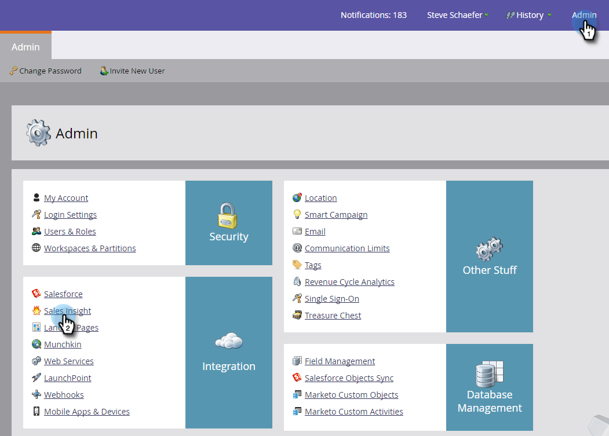
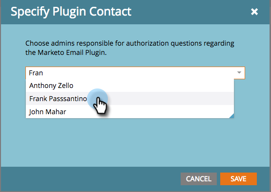
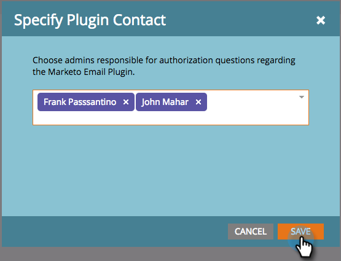
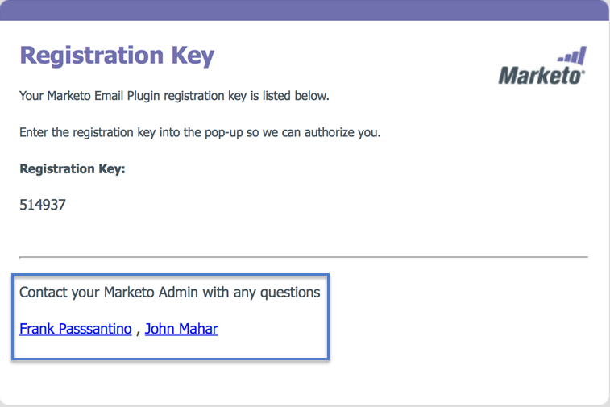

# Specify Marketo Sales Insight Plugin Admins {#specify-marketo-sales-insight-plugin-admins}

You can specify which contacts you want to appear in the email notice you send to users when you invite them to set up MSI on Outlook.

1. In My Marketo, click **Admin** and then **Sales Insight**.

   

1. Click the **Email Add-In** tab.

   

1. Click **Specify Plugin Contact**.

   

1. Click to specify plugin contacts.

   

1. Click **Save**.

   

1. The contacts you selected will be listed in the email sales reps receive during the authorization process.

   

   Perfect!
