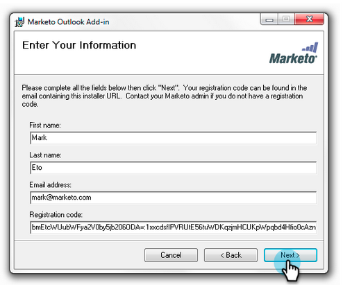
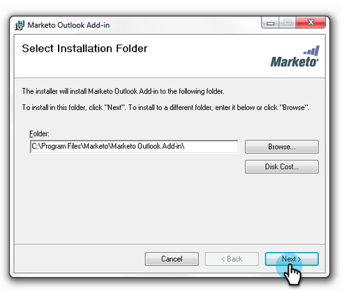
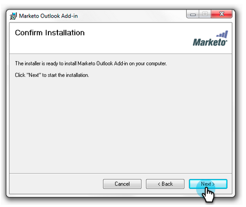

# Upgrade your Marketo Email Add-In for [!DNL Outlook] {#upgrade-your-marketo-email-add-in-for-outlook}

When a new version of the Marketo Email Add-in for [!DNL Outlook] is available, follow these instructions to upgrade.

>[!NOTE]
>
>As of 10/1/20, the latest version of the [!DNL Outlook] plug-in no longer supports offline mode. This will take effect after installing/upgrading on or after 10/1.

## Download Installer {#download-installer}

Download the installer appropriate for your version of Microsoft [!DNL Outlook].

<table> 
 <colgroup> 
  <col> 
  <col> 
  <col> 
  <col> 
  <col> 
 </colgroup> 
 <tbody> 
  <tr> 
   <th> </th> 
   <th colspan="2">Single User Invite Installation</th> 
   <th colspan="2">Enterprise Key Installation</th> 
  </tr> 
  <tr> 
   <td><strong>Outlook Version</strong></td> 
   <td><strong>32-bit</strong></td> 
   <td><strong>64-bit</strong></td> 
   <td><strong>32-bit</strong></td> 
   <td><strong>64-bit</strong></td> 
  </tr> 
  <tr> 
   <td>Outlook 2000</td> 
   <td>Not Supported</td> 
   <td>N/A</td> 
   <td>Not Supported</td> 
   <td>N/A</td> 
  </tr> 
  <tr> 
   <td>Outlook 2003</td> 
   <td><a href="https://munchkin.marketo.net/MarketoAddInSetup32.msi" rel="nofollow">Download</a></td> 
   <td>N/A</td> 
   <td>Not Supported</td> 
   <td>N/A</td> 
  </tr> 
  <tr> 
   <td>Outlook 2007</td> 
   <td><a href="https://munchkin.marketo.net/MarketoAddInSetup32.msi" rel="nofollow">Download</a></td> 
   <td>N/A</td> 
   <td>Not Supported</td> 
   <td>N/A</td> 
  </tr> 
  <tr> 
   <td>Outlook 2010</td> 
   <td><a href="https://munchkin.marketo.net/MarketoAddInSetup32.msi" rel="nofollow">Download</a></td> 
   <td><a href="https://munchkin.marketo.net/MarketoAddInSetup64.msi" rel="nofollow">Download</a></td> 
   <td><a href="https://munchkin.marketo.net/MarketoAddInSetup32.msi" rel="nofollow">Download</a></td> 
   <td><a href="https://munchkin.marketo.net/MarketoAddInSetup64.msi" rel="nofollow">Download</a></td> 
  </tr> 
  <tr> 
   <td>Outlook 2013</td> 
   <td><a href="https://munchkin.marketo.net/MarketoAddInSetup32.msi" rel="nofollow">Download</a></td> 
   <td><a href="https://munchkin.marketo.net/MarketoAddInSetup64.msi" rel="nofollow">Download</a></td> 
   <td><a href="https://munchkin.marketo.net/MarketoAddInSetup32.msi" rel="nofollow">Download</a></td> 
   <td><a href="https://munchkin.marketo.net/MarketoAddInSetup64.msi" rel="nofollow">Download</a></td> 
  </tr> 
  <tr> 
   <td>Outlook 2016</td> 
   <td><a href="https://munchkin.marketo.net/MarketoAddInSetup32.msi" rel="nofollow">Download</a></td> 
   <td><a href="https://munchkin.marketo.net/MarketoAddInSetup64.msi" rel="nofollow">Download</a></td> 
   <td><a href="https://munchkin.marketo.net/MarketoAddInSetup32.msi" rel="nofollow">Download</a></td> 
   <td><a href="https://munchkin.marketo.net/MarketoAddInSetup64.msi" rel="nofollow">Download</a></td> 
  </tr> 
  <tr> 
   <td colspan="1">Outlook 2019</td> 
   <td colspan="1"><a href="https://munchkin.marketo.net/MarketoAddInSetup32.msi" rel="nofollow">Download</a></td> 
   <td colspan="1"><a href="https://munchkin.marketo.net/MarketoAddInSetup64.msi" rel="nofollow">Download</a></td> 
   <td colspan="1"><a href="https://munchkin.marketo.net/MarketoAddInSetup32.msi" rel="nofollow">Download</a></td> 
   <td colspan="1"><a href="https://munchkin.marketo.net/MarketoAddInSetup64.msi" rel="nofollow">Download</a></td> 
  </tr> 
  <tr> 
   <td>Outlook for Mac</td> 
   <td>Not Supported</td> 
   <td>Not Supported</td> 
   <td>Not Supported</td> 
   <td>Not Supported</td> 
  </tr> 
  <tr> 
   <td colspan="1">Outlook Web App</td> 
   <td colspan="1">Not Supported</td> 
   <td colspan="1">Not Supported</td> 
   <td colspan="1">Not Supported</td> 
   <td colspan="1">Not Supported</td> 
  </tr> 
  <tr> 
   <td colspan="1">Office 365&#42;</td> 
   <td colspan="1"><a href="https://munchkin.marketo.net/MarketoAddInSetup32.msi" rel="nofollow">Download</a></td> 
   <td colspan="1"><a href="https://munchkin.marketo.net/MarketoAddInSetup64.msi" rel="nofollow">Download</a></td> 
   <td colspan="1"><a href="https://munchkin.marketo.net/MarketoAddInSetup32.msi" rel="nofollow">Download</a></td> 
   <td colspan="1"><a href="https://munchkin.marketo.net/MarketoAddInSetup64.msi" rel="nofollow">Download</a></td> 
  </tr> 
 </tbody> 
</table>

&#42;[!DNL Office] 365 version: [!DNL Windows] client only (on [!DNL Windows] 10, [!DNL Enterprise] or [!DNL Pro]).

## Upgrade {#upgrade}

1. Identify your [[!DNL Microsoft Outlook] version](https://support.microsoft.com/en-us/office/what-version-of-outlook-do-i-have-b3a9568c-edb5-42b9-9825-d48d82b2257c?ui=en-us&rs=en-us&ad=us).

1. Select your version from the list above.

1. Run the installer.

   

1. Click **[!UICONTROL Next]**.

   

   >[!NOTE]
   >
   >In certain cases the data will be missing. Copy it from the registration email then close [!DNL Outlook].

1. Close [!DNL Microsoft Outlook].

   

1. You will notice all your information is prefilled. Simply click **[!UICONTROL Next]**.

   

   >[!TIP]
   >
   >If the install fails, work with your IT department to ensure that HTTPS traffic is not blocked. The installer requires HTTPS traffic to be open.

1. Click **[!UICONTROL Next]** to install in the default location.

   

1. Click **[!UICONTROL Next]**.

   

1. The install has now completed. Click **[!UICONTROL Close]**.

   

1. Now open [!UICONTROL Microsoft Outlook] to see the latest version of the Marketo buttons.

   

>[!MORELIKETHIS]
>
>* [Send and Track an Email with the Marketo Email Add-in for [!UICONTROL Outlook]](/help/marketo/product-docs/marketo-sales-insight/msi-outlook-plugin/send-and-track-an-email-with-the-email-add-in-for-outlook.md)
>* [Send and Track from [!UICONTROL Outlook] Using a Marketo Template](/help/marketo/product-docs/marketo-sales-insight/msi-outlook-plugin/send-and-track-from-outlook-using-a-marketo-template.md)
