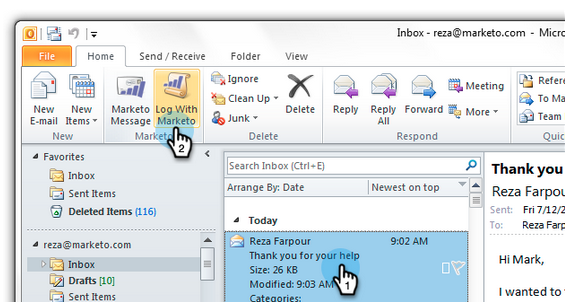
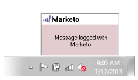
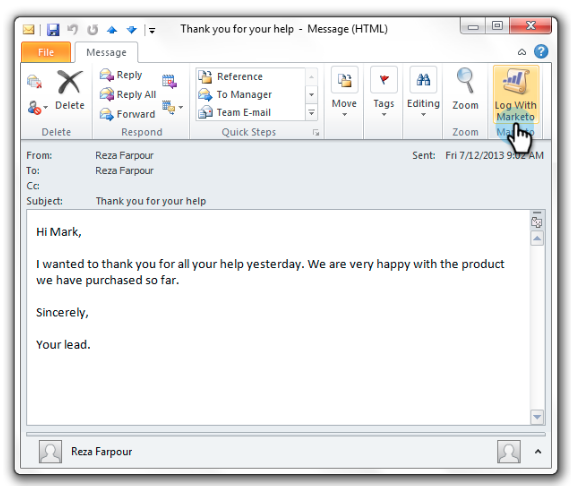

# Log Inbound Mail From Your Leads in Marketo {#log-inbound-mail-from-your-leads-in-marketo}

You can log replies from your leads right in [!DNL Outlook] with the Marketo Email Add-In.

## From the Main [!DNL Outlook] Application {#from-the-main-outlook-application}

1. Select the email you want to log and click **[!UICONTROL Log with Marketo]**.

>[!TIP]
>
>You can also right-click on a message and click **[!UICONTROL Log With Marketo]**.

You should see a confirmation.

## From the Email Itself {#from-the-email-itself}

If you have opened the email, you can simply click on the **[!UICONTROL Log with Marketo]** button from there.

You should see the same confirmation as the other method.

Log your lead's replies to add them to their history in Marketo.

>[!MORELIKETHIS]
>
>* [Send and Track an Email with the Marketo Email Add-in for Outlook](/help/marketo/product-docs/marketo-sales-insight/msi-outlook-plugin/send-and-track-an-email-with-the-email-add-in-for-outlook.md)
>* [Send and Track from Outlook Using a Marketo Template](/help/marketo/product-docs/marketo-sales-insight/msi-outlook-plugin/send-and-track-from-outlook-using-a-marketo-template.md)
