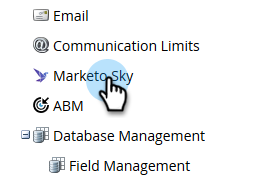
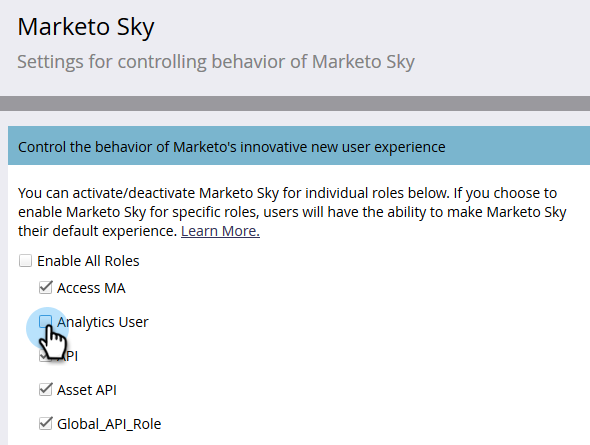

# Enabling Roles for [!UICONTROL Marketo Sky] {#enabling-roles-for-marketo-sky}

In order to utilize [!UICONTROL Marketo Sky], roles for desired users must be enabled.

>[!IMPORTANT]
>
>[!DNL Marketo Sky] will deprecated in March of 2022. [Click here](https://nation.marketo.com/t5/the-modern-ux/marketo-sky-deprecation-notice/ba-p/320115#M33) to learn more.

>[!NOTE]
>
>**Admin Permissions Required**

1. In [!DNL Marketo Classic], click **[!UICONTROL Admin]**.

   

1. In the tree, select **[!UICONTROL Marketo Sky]**.

   

1. Select the desired role(s).

   

The selected roles are now able to use [!UICONTROL Marketo Sky].
