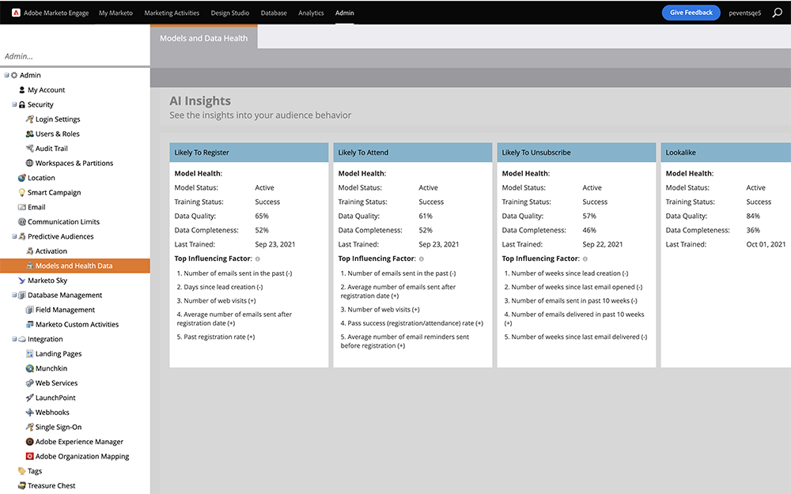

# Model Health and Data Validity {#model-health-and-data-validity}

The performance of your models depends on the quality and completeness of the input data. See the top influencing factor for each of your likelihood AI models. Also see top factors resulting in higher/lower event registration, event attendance, or unsubscribes.

>[!NOTE]
>
>Behaviors marked with (+) influence predictions positively (and vice versa).

Here's how to assess your model health.

Navigate to the **[!UICONTROL Models and Data Health]** section under **[!UICONTROL Predictive Audiences]** in the **[!UICONTROL Admin]** area of Marketo Classic. Here you will see all of your models and their statuses.

   

* **Training Status**: Indicates whether your model is actively training (improving predictions). Training automatically occurs every 2 weeks. Any models that are _Processing_ could take up to 24 hours to finish. For any _Failed_ models, please contact [Marketo Support](https://nation.marketo.com/t5/Support/ct-p/Support).
* **Scoring Status**: Indicates whether your model is actively calculating predictions (likelihood percentages) for program members.
* **Performance**: Categorization of your model health based on Data Completeness and Data Quality (see below).
* **Data Completeness**: Percentage of data attributes that are present/complete.
* **Data Quality**: Percentage of attributes that contain good, usable data.