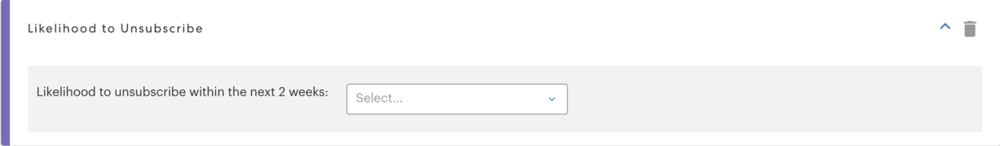
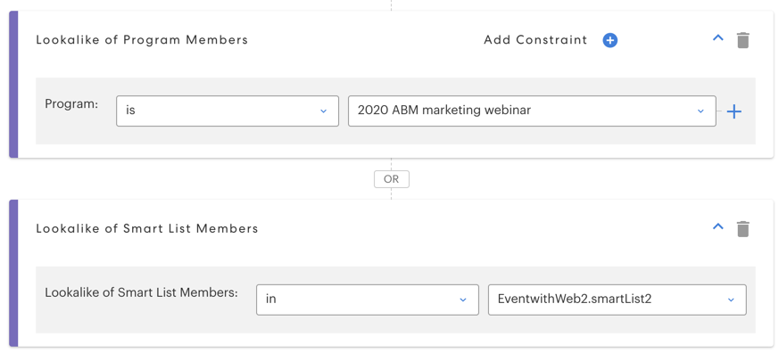

# [!UICONTROL Predictive Filters] {#predictive-filters}

As part of Predictive Audiences, Marketo offers a group of AI/ML-based filters in smart lists.

   

>[!NOTE]
>
>The "[!UICONTROL Likely to Attend]" and "[!UICONTROL Likely to Register]" filters are only be able to be used in Event or Email programs. "[!UICONTROL Likelihood to Unsubscribe]", "[!UICONTROL Lookalike of Program Members]", and "[!UICONTROL Lookalike of Smart List Members]" can be used in all program types.

## [!UICONTROL Likelihood to Attend]

This filter is used to effectively narrow down your audience. This helps you target and invite leads who have a higher likelihood of **attending** your webinar or event. Note that your "[!UICONTROL Likelihood to Attend program]" will be your current event program.

   

## [!UICONTROL Likelihood to Register]

Similar to the _[!UICONTROL Likelihood to Attend]_ filter, use this filter to narrow your audience and target leads who have a higher likelihood of **registering** for your webinar or event.

   

## [!UICONTROL Likelihood to Unsubscribe]

This filters the audience by whether they have a high or low likelihood of unsubscribing in the next two weeks. You can use this to target high-fatigue leads differently and more effectively. The unsubscribe threshold is dynamic and driven by an AI model that considers several attributes, including lead time in the database and lead activities.

   

>[!NOTE]
>
>The Likelihood to Attend/Register/Unsubscribe filters must be used in conjunction with other standard filters.

## [!UICONTROL Lookalike of Program Members]/[!UICONTROL Lookalike of Smart List Members]

These two filters help you expand your current audience by targeting additional leads that are similar to members of another program or Smart List. The Lookalike filters consider 50+ factors, including lead attributes, email activity, web activity, and engagement.

Click **[!UICONTROL Add Constraint]** to choose success criteria for members of the selected program(s).

Click the + icon next to the program drop-down to easily add multiple programs/smart lists to one filter.

   
