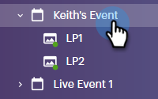

# Setting an Event Cap {#setting-an-event-cap}

Limit the amount of people who can register for your event with an event cap.

>[!NOTE]
>
>Not everyone has purchased this feature. Please contact the Adobe Account Team (your Account Manager) for details.

>[!IMPORTANT]
>You must have at least two approved landing pages (a Registration page and a Registration Full page) in the program before you can set an event cap.

>[!NOTE]
>
>To free up space in an event, the program member must be removed (you can do this by updating their status to "Not in Program").

1. Select your event program.

   

1. In the Overview, find [!UICONTROL Event Cap] and click **[!UICONTROL Not Set]**.

   

1. Enter the maximum amount of people you want to be able to register for your event and click **[!UICONTROL Next]**.

   

1. Click the [!UICONTROL Registration Page] drop-down and select the landing page that will act as your registration page.

   

1. Click the **[!UICONTROL Registration Full Page]** drop-down and select the landing page that will act as your registration full page. Click **[!UICONTROL Set and Enable]** when done.

   

   You're all set. If you decide you want to edit the event cap details, click the blue text next to [!UICONTROL Event Cap] and repeat from Step 3 on.

   
