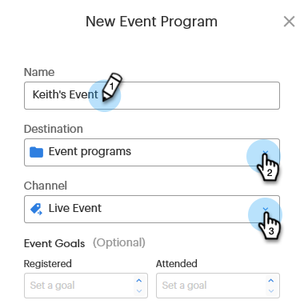
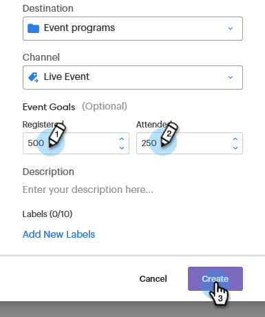

# Setting Event Goals {#setting-event-goals}

Give your events specific goals and see how they perform.

>[!IMPORTANT]
>
>Not everyone has purchased this feature. Please contact the Adobe Account Team (your Account Manager) for details.

1. Create an event program.

   

1. Give your event a [!UICONTROL Name], select the [!UICONTROL Destination] folder and [!UICONTROL Channel].

   

1. Enter the goal for [!UICONTROL Registered] and [!UICONTROL Attended], then click **[!UICONTROL Create]** ([!UICONTROL Description] and [!UICONTROL Labels] are optional).

   

And that's it! Check your event goal status by clicking on the [!UICONTROL Reports] tab.
