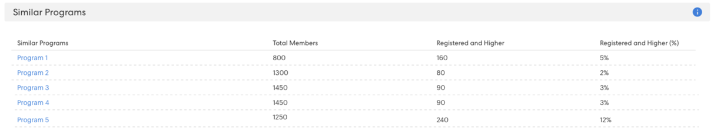
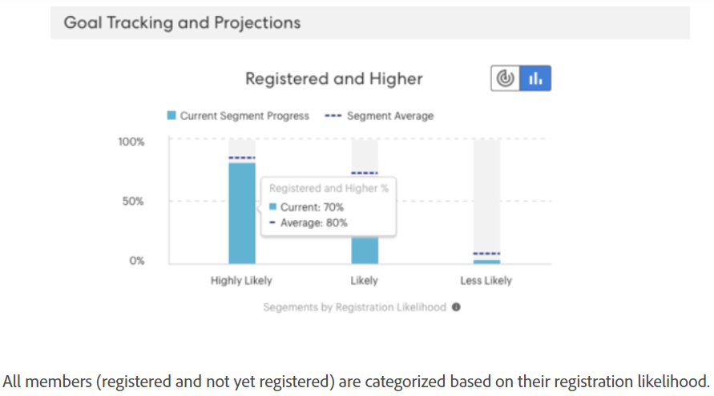

# Understanding Goal Tracking and Projected Registrations {#understanding-goal-tracking-and-projected-registrations}

After [setting event goals](/help/marketo/product-docs/marketo-sky/setting-event-goals.md) and sending out invites through a [smart campaign](/help/sky/create-a-smart-campaign.md), here's how to track your goal progress and understand Marketo's predictions.

>[!NOTE]
>
>When an event program is created in the Marketo Classic experience the event start date currently defaults to the event creation date. Since projected registrations take into account the amount of time before an event's start date, these numbers may not be accurate if the start date and creation date are the same (unless set intentionally).

## Goal Tracking and Projected Registrations {#goal-tracking-and-projected-registrations}

1. You can find goal tracking details in the **[!UICONTROL Reports]** tab of your event program. In this particular example, there are 150 registered members so far against a goal of 200 (75%).

   

You'll also see your **[!UICONTROL Projected]** registrations. Hover over the info icon to see a breakdown of this number by Likelihood segment.

   

>[!NOTE]
>
>The Attended and Higher chart will remain empty until the day of the event.

1. Click the Chart toggle to switch to a breakdown of your members by registration likelihood. You'll see current registration percentages for each segment, compared to the average percentage for that segment in your past programs.

   

All members (registered and not yet registered) are categorized based on their registration likelihood. Hover over the info icon to see how these likelihood categories are defined.

   

>[!NOTE]
>
>Prediction numbers are updated every 24 hours until the day of the event. Any members who are listed as _Processing_ will be included in the next calculation cycle.

## Similar Programs {#similar-programs}

You can gain some insight into your current event by looking at how similar programs performed in the past. This section shows you up to 5 similar programs from the last 6 months, with the number/percentage of members who were _Registered_ or higher.

In calculating similar programs, we include the following factors, among others:

* Program type
* Program channel
* Audience size
* Program tags
* Time duration from event creation to event start
* Event duration

   

## Recommendations {#recommendations}

At the top of the Reports page, you can find AI/ML-driven recommendations based on your progress. Check back periodically for helpful tips and insights!

   

## Person-Level Predictions {#person-level-predictions}

Click the **[!UICONTROL Members]** tab to view all your program members. Hover over the **[!UICONTROL Registration Likelihood]** or **[!UICONTROL Attendance Likelihood]** bars to see exact percentages and categorizations. You can then take action on members in a particular category (e.g., everyone in the "Less Likely" to register category), and specifically target them to potentially boost your registration numbers.

   

>[!NOTE]
>
>Individual likelihood takes into account 40+ person factors, including profile attributes, person activity, and past invited/registered/attended activities.

## FAQ {#faq}

**Q: What is the segment?**

A: Likely to register is a value from 0 to 100. Every person who's a member of the event program will get a likelihood value between 0-100.

We put likelihood values into three segments:

* Likelihood to register >50% = Highly Likely segment
* Likelihood to register >25% to <50% = Likely segment
* Likelihood to register <25% = Less Likely segment

When a person gets likelihood to register, the prediction will fall into one of these segments (every person who's a member of a program will fall into one of them). For example, if an event program has 1000 members based on the likelihood predictions, those 1000 would get distributed into _Highly Likely_, _Likely_, or _Less Likely_ segments.

Therefore, people who fall into the Highly Likely segment will have a higher chance of registering for the event.

Conversion to register = # of people in segment registered divided by # of people who fall into the segment (for example--if 100 people fall into the Highly likely segment and 60 of them register, the conversion rate is 60%).

Conversion % to register will follow this pattern: Highly likely > Likely > Less likely.

**Q: How do I use the insights?**

A: Best practice entails the following:

i. You create a program, and then a Smart Campaign uses predictive filters with "greater than X," which would result in a certain amount of people (let’s say 1000) and you run the campaign.

ii. After 24 hours, in the [!UICONTROL Reports] tab you can see the projected registrations that are calculated based on the likelihood to register values of all the people who are currently invited.

iii. If projected registrations are less than the goal, you would have to invite more people. At this point, you can see the insights that tell you what the threshold was that worked in past programs.

   

iv. You can create a new Smart Campaign with that threshold to invite more people.

v. At any point in time if you want to understand why a projected number is showing, you can toggle to see the audience distribution across segments, their conversion rates from the past, and apply those conversion rates to the current audience (see screenshot below).

**Q: What is the Segments by Registration graph?**

A: Three bars, each one representing a segment (Highly Likely, Likely, Less Likely).

**Purple dotted line:** Average conversation rate to registration in that segment, based on past similar programs.

**Blue bar:** Registration percentage of all people in that segment.

   

Example, let’s say 100 people have likelihood to register > 50% and 60 out of those 100 people registered. Highly likely has 60% conversion. So, all member added to the program get likelihood to register values, then they are put into segments and as per the number of people registered in each segment conversion rate is calculated.

**Q: What does "Registered and Higher” mean?**

A: Any person who is listed as registered, or any other status with an equal or higher step number.

You can create new progression statuses for an event program, but we map those statuses with standard statuses. Consider a case where a person is moved from invited to reminded, which is a higher step than register. This person will also be considered as registered and shown in the goal tracking.

   

**Q: How are projected registrations calculated?**

A: See below.

   
