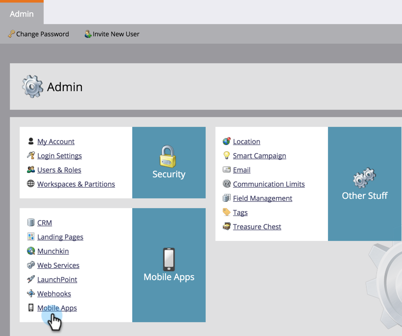
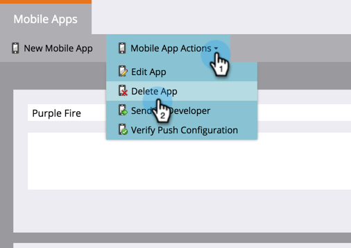
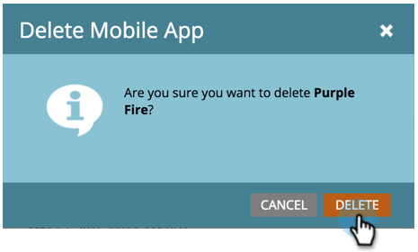

# Delete Mobile App {#delete-mobile-app}

##### 1. Click on Admin. {#click-on-admin}

  

##### 2. Select Mobile Apps. {#select-mobile-apps}

 

##### 3. Select the desired mobile app. {#select-the-desired-mobile-app}

  

##### 4. Click Mobile App Actions and select Delete App. {#click-mobile-app-actions-and-select-delete-app}

  

##### 5. Confirm by clicking DELETE. {#confirm-by-clicking-delete}

Ta-da! Push notification can no longer be sent from this mobile app. 
