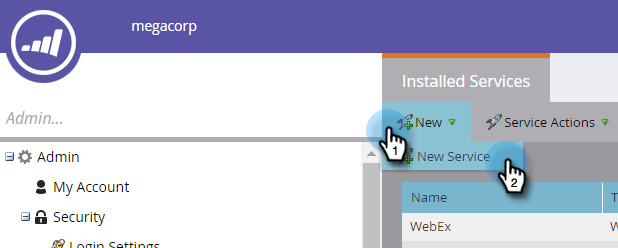
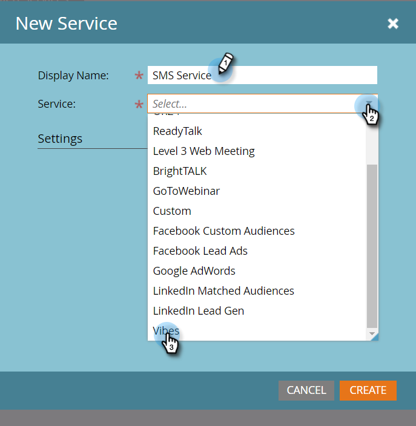

# Add Vibes as a LaunchPoint Service {#add-vibes-as-a-launchpoint-service}

You can send SMS messages to the people in your Vibes lists and use the SMS activity to trigger and filter campaigns. First, you need to add Vibes as a LaunchPoint service.

>[!NOTE]
>
>**Admin Permissions Required**

>[!NOTE]
>
>You need both Marketo Admin permissions and an active Vibes account to complete this setup. The credentials requested in Step 4 below are the credentials from your Vibes account.

1. In My Marketo, click **Admin** and then **LaunchPoint**.

   

1. Click **New** and **New Service**.

   

1. Enter a display name and in the drop-down, select **Vibes**.

   

1. Under Settings, enter your Vibes username, password, and API Company Key. Click **Create**.

   

   The new SMS service now appears in the Installed Services list.

   
