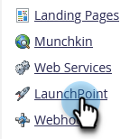
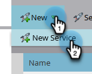
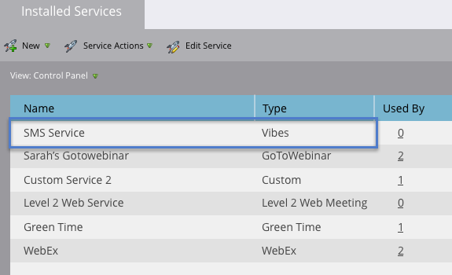

# Add Vibes as a LaunchPoint Service {#add-vibes-as-a-launchpoint-service}

You can send SMS messages to the people opted in to your Vibes SMS campaigns, leveraging SMS activity to trigger and filter campaigns navitvely in your Marketo Engage instance. First, you need to add Vibes as a LaunchPoint service. 

>[!NOTE]
>
>**Admin Permissions Required**

>[!AVAILABILITY]
>
>You must have an active Vibes account and an Adobe license for Vibes SMS. Marketo Vibes SMS native integration is available in the U.S. and Canada. For other countries, a connection via Marketo Webhooks can be utilized by [contacting Vibes directly](https://www.vibes.com/talk-to-sales){target="_blank"}.

1. In My Marketo, go to the **[!UICONTROL Admin]** area.

   

1. Click **[!UICONTROL LaunchPoint]**.

   

1. Click **[!UICONTROL New]**, then **[!UICONTROL New Service]**.

   

1. Enter a display name and in the drop-down, select **[!UICONTROL Vibes]**.

   

1. Under Settings, enter your Vibes [!UICONTROL Username], [!UICONTROL Password], and [!UICONTROL Company Key] (all of which can be found in your Vibes account). Click **[!UICONTROL Create]**.

   

   The new SMS service now appears in the [!UICONTROL Installed Services] list.

   

>[!MORELIKETHIS]
>
>[Vibes video demo](https://vimeo.com/215233767/1ed136adbc){target="_blank"}
